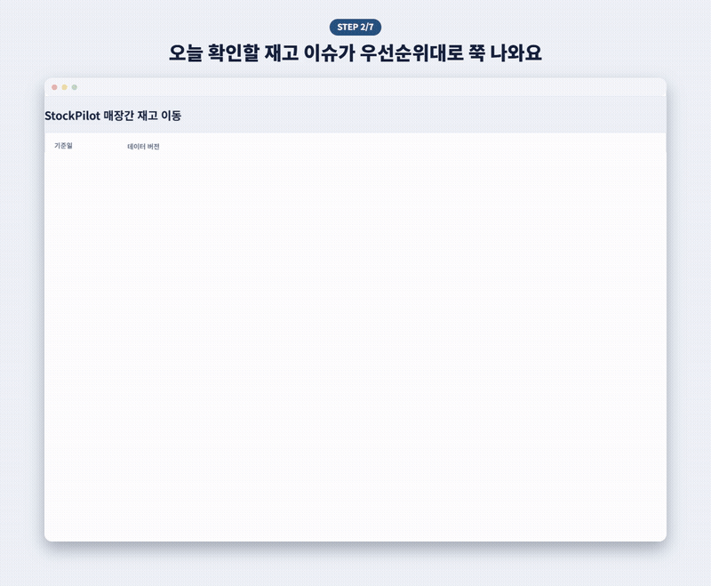
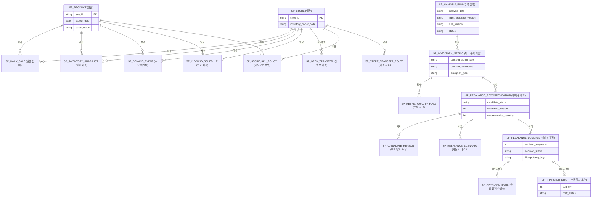

# StockPilot

> 패션 리테일의 매장별·SKU별 재고 불균형을 찾아, 담당자가 **근거를 확인하고
> 매장간 이동수량을 검토·승인**할 수 있게 만든 재고 배분 의사결정 지원 서비스

판매·재고·행사·입고·이동 데이터를 함께 계산해 **검토 대상 → 공급 후보 → 이동
시나리오 → 사람의 결정 → ERP 이동요청 초안**까지 연결합니다.

## 개요

### 주제

패션 리테일의 매장간 재고 이동(재배분) 의사결정을 지원하는 웹 서비스입니다. 재고
예외를 자동으로 탐지하고, 실행 가능한 이동안과 근거를 검토·승인 흐름으로
연결합니다.

### 문제

“재고가 많은 매장에서 적은 매장으로 보낸다”만으로는 해결되지 않습니다.

1. **검토 대상이 많습니다.** 상품·매장 조합이 커질수록 모든 건을 같은 깊이로
   볼 수 없습니다.
2. **판매량이 곧 수요는 아닙니다.** 품절, 행사, 단체구매는 실제 수요와 다르게
   읽힙니다.
3. **공급 매장도 지켜야 합니다.** 이동 후 공급 매장의 안전재고가 무너지면
   안 됩니다.
4. **물류·정책 제약이 있습니다.** 소유권·경로·리드타임·최소/최대 수량을
   통과해야 실행 가능한 안이 됩니다.
5. **추천과 승인 사이 시간이 흐릅니다.** 동시 승인, 재시도, 오래된 결과로 인한
   중복 이동을 막아야 합니다.

목표는 수요를 정확히 예언하는 것이 아니라, 왜 이 대상이 올라왔고 어떤 이동안이
가능한지를 검증 가능한 근거로 보여주는 것입니다.

### 사용자

본사 재고 배분·보충 담당자(Allocator / Replenishment Planner)

### 해결 방식

28일 판매·재고를 분석해 수요 신호와 데이터 신뢰도를 분리하고, 이동 제약을 통과한
후보와 low/base/high 시나리오를 제공합니다. 승인 시 ERP 이동요청 초안이
생성되며, 실제 이동 실행은 ERP/WMS/TMS의 책임입니다.

| 문제 | 해결 |
|---|---|
| 수작업 전수 검토 | Spring Batch가 예외·심각도·검토 우선순위를 자동 산출 |
| 왜곡된 판매 관측 | 품절·행사·단체구매를 분리해 수요 신호와 신뢰도로 저장 |
| 한 숫자로 이동량 단정 | 무조치·보수·기준·공격 시나리오와 수동 수량 시험 제공 |
| 실행 불가능한 추천 | 소유권·경로·리드타임·수용량을 검사하고 탈락 사유 저장 |
| 추천 이후 데이터 변화 | 승인 시 최신 근거를 재조회해 stale 요청 거부 |
| 재시도·동시 승인 | `Idempotency-Key`와 잠금 순서, unique constraint로 방어 |
| AI를 업무 규칙으로 오인 | 계산과 AI 설명의 책임 경계를 분리 |

- **AI는 이동량을 정하지 않습니다.** 수량·상태는 결정론적 Java 규칙이 계산합니다.
- **추천을 바로 집행하지 않습니다.** 담당자가 검토한 뒤 보류·승인·반려합니다.
- **승인도 다시 검증합니다.** 최신 근거를 트랜잭션 안에서 재계산합니다.
- **실제 기업 데이터가 아닙니다.** 데이터는 `SYNTHETIC`, 정책은 versioned
  `ASSUMPTION`입니다.

### 주요 기능

- **분석 실행/재사용**: 동일 조건의 완료 결과를 재사용합니다.
- **업무 큐 요약과 업무 상태**: KPI 타일과 5단계 업무 상태로 오늘 볼 대상을
  좁힙니다.
- **재고 예외 큐**: 유형·심각도·신뢰도·업무 상태로 필터링·정렬합니다.
- **근거 상세**: 판매·재고·행사·입고·이동·정책을 한 화면에서 확인합니다.
- **후보·시나리오 비교**: 통과/탈락 사유와 네 시나리오를 비교합니다.
- **수동 수량 시험**: 저장 없이 임의 수량의 제약 통과 여부를 계산합니다.
- **보류·승인·반려**: 자동 수량시험 후 확인 대화상자를 거쳐 append-only로
  저장합니다.
- **처리 이력과 승인 근거**: 결정 이력과 ERP 이동요청 초안을 조회합니다.
- **AI 설명(선택)**: provider가 없어도 핵심 기능은 정상 동작합니다.

## 사용한 기술

### 기술 스택

| 구분 | 내용 |
|---|---|
| Backend | Java 21, Spring Boot 4.1, Spring Batch, Spring Data JPA, Flyway |
| Frontend | React 19, TypeScript, Vite, Testing Library, Vitest |
| Database / Infra | Oracle Database, Docker Compose |
| 검증 규모 | Backend 527/527, Frontend 106/106, Flyway V1~V16 |

### 아키텍처

| 영역 | 책임 |
|---|---|
| React Frontend | 분석 실행, 예외 목록·상세, 시나리오 비교, 결정·이력 표시 |
| Spring MVC API | run-bound 조회, 오류 응답, simulation·decision command 경계 |
| Spring Batch | 입력을 고정 8개 bulk query로 읽고 원자적으로 저장 |
| Pure Java Domain | 수요 신호, 재고 projection, 후보 제약, scenario 검증 |
| Spring Data JPA | 결과 조회, 결정·근거·초안 영속화와 명시적 lock |
| Oracle + Flyway | 입력·산출·감사 데이터, 제약, V1~V16 schema history |
| Optional AI Boundary | 계산된 사실의 설명만 담당. 비활성 시에도 핵심 흐름 정상 |

읽기 경로는 완료된 분석 결과만 반환하고, 승인 경로는 잠금 후 최신 근거를 다시
읽어 원자적으로 씁니다.

### 설계 포인트

- **계산 로직을 프레임워크에서 분리**: 순수 Java 객체로 구현해 Oracle 없이도
  빠르게 검증합니다.
- **설명 가능한 규칙과 버전**: 정렬 키와 탈락 사유를 저장하고 입력·규칙
  버전을 함께 남깁니다.
- **Batch의 bounded I/O**: 입력을 정확히 8개 bulk query로 고정해 N+1을
  피합니다.
- **승인 API의 멱등성·동시성 방어**: `Idempotency-Key`와 잠금 순서로
  재전송·경쟁을 막습니다.
- **AI를 핵심 경로 밖에 둔 이유**: 같은 입력에서 같은 결과가 나와야 감사할 수
  있습니다.

## ERD

ERD는 데이터를 세 층으로 나눴습니다.

1. **입력 사실과 정책**: 상품·매장, 일별 판매·재고, 행사, 입고, 진행 중 이동,
   경로와 매장-SKU 정책
2. **분석 결과**: 분석 실행, 재고 지표, 품질 플래그, 이동 후보와 시나리오
3. **사람의 결정과 감사**: append-only 결정, 승인 시점 근거, ERP 이동요청 초안

전체 schema와 자연키·FK·CHECK는
[`knowledge/data-model.md`](knowledge/data-model.md)에 정리했습니다.

## 트러블슈팅

### 1. 소수 정밀도를 늘려도 이동수량이 1개씩 틀리던 문제

**문제** 판매수량을 `BigDecimal`로 나눴다가 다시 곱하는 계산 구조 자체가
반올림 오차를 만들어 `ceil` 경계에서 이동량이 1개 많게 나왔습니다.

**해결** 나눗셈을 없애고 정수 올림 나눗셈
`(numerator + denominator - 1) / denominator`으로 바꿨습니다.

**배운 점** 수량 도메인에서는 정밀한 소수보다 단위를 보존하는 정수식이 더
안전합니다.

관련 코드: [`RebalanceCalculation.java`](backend/src/main/java/com/bapegg/stockpilot/rebalance/RebalanceCalculation.java)

### 2. 같은 재고가 중복 승인되거나 오래된 추천이 승인될 수 있던 문제

**문제** 동시 승인, 재시도, 오래된 분석 결과로 인해 단순 저장만으로는 중복
승인과 공급량 초과를 막을 수 없었습니다.

**해결** `Idempotency-Key`로 재전송을 구분하고, 추천 → 공급 재고 순서로 잠근
뒤 최신 근거를 재계산해 stale이면 거부하고, 성공 시에만 한 트랜잭션으로
저장했습니다.

**배운 점** 동시성은 업무 식별자, 잠금 순서, 최신성 재검증, DB 제약을 함께
설계해야 막을 수 있습니다.

관련 코드:
[`ApprovalTransactionFacade.java`](backend/src/main/java/com/bapegg/stockpilot/approval/ApprovalTransactionFacade.java),
[`ApprovalTransactionExecutor.java`](backend/src/main/java/com/bapegg/stockpilot/approval/ApprovalTransactionExecutor.java),
[`CurrentApprovalBasisLoader.java`](backend/src/main/java/com/bapegg/stockpilot/approval/CurrentApprovalBasisLoader.java)

### 3. 로컬 개발 DB가 최신 Flyway 마이그레이션과 조용히 어긋나 있던 문제

**문제** 오래 켜둔 로컬 Oracle 컨테이너가 `Migration checksum mismatch`로
기동에 실패했습니다. 파일은 git과 일치했지만 DB에 적용된 버전은 예전
상태였습니다.

**해결** 볼륨을 완전히 지우고 V1~V16을 처음부터 재적용했습니다(전부
SYNTHETIC 데이터). 이 과정에서 존재하지 않는 상품·매장을 참조하던 V16
마이그레이션도 함께 고쳤습니다.

**배운 점** “파일이 git과 일치한다”와 “DB가 그 파일 그대로 적용됐다”는 다른
명제입니다. 의심스러우면 볼륨을 통째로 재생성해 재현되는지 확인하는 편이
빠릅니다.

관련 코드: [`V16__expand_mvp2_demo_scenario_v2.sql`](backend/src/main/resources/db/migration/V16__expand_mvp2_demo_scenario_v2.sql)

## 검증 결과

2026-08-31 기준 실제 실행이 확인된 결과입니다.

| 검증 | 결과 |
|---|---|
| Oracle Backend 전체 | 527/527 통과, skip·실패·오류 0 |
| Flyway | V1~V16 처음부터 clean migration·validation 통과 |
| Frontend | 106/106 통과, `tsc --noEmit` clean, production build 통과 |
| 목록 query ceiling | size=1/size=100 동일 statement 수(9) |
| 실제 분석 실행 | 확장 데모 스냅샷(6개 상품 × 9개 매장) 기준 54건 정상 산출 |
| Browser 수용 시나리오 | 갱신 → 검토 → 후보 선택·수량시험 → 승인까지 전체 흐름 확인 |
| Repository | `git diff --check` exit 0 |

## 설계 참고 자료

- [Oracle Retail 재배분 workflow](https://docs.oracle.com/en/industries/retail/retail-inventory-planning-optimization-cloud/26.1.101.0/ipoio/workflow1.htm)
- [Oracle Retail 매장 이동](https://docs.oracle.com/en/industries/retail/store-inventory-op-cloud/latest/rsoug/transfers.htm)

공개된 일반적인 리테일 재배분 업무 흐름을 참고했습니다.
