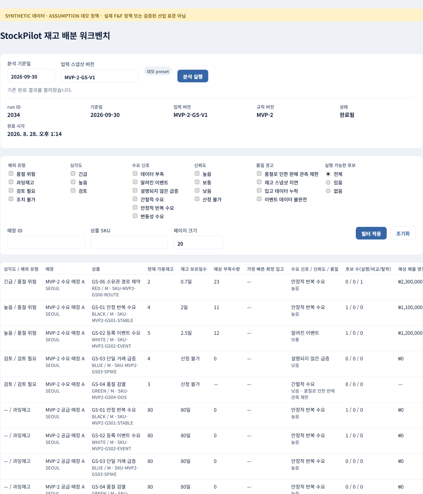

# StockPilot

> 패션 리테일 재고 배분 담당자가 **수요 신호와 데이터 신뢰도를 확인하고, 실행
> 가능한 재배분 시나리오를 비교**하도록 돕는 재고 예외 검토 및 재배분
> 의사결정 워크벤치

패션 리테일은 상품·색상·사이즈와 매장 조합이 많아 모든 재고 위치를 같은
깊이로 검토하기 어렵습니다. 단순 기간 평균만 보면 하루의 대량구매를
반복수요로 오인하거나, 품절로 판매가 멈춘 상품을 무수요로 오인할 수
있습니다. StockPilot은 수요를 정확히 예언하거나 이동을 자동 집행하지
않습니다. 담당자가 오늘 볼 대상을 줄이고, 다음 판단에 필요한 근거를
한 화면에 모읍니다.

> `SYNTHETIC` 데이터 · `ASSUMPTION` 데모 정책 · 실제 F&F 정책 또는 검증된
> 산업 표준이 아님

## 실제 워크벤치 화면



담당자는 다음 5단계로 하나의 예외를 검토·결정합니다.

```text
분석 실행/재사용
  → 재고 예외 큐 필터·우선순위 확인
  → 28일 근거·품질·후보·자동 시나리오 검토
  → 부작용 없는 MANUAL 수량 시험
  → 보류·승인·거절 결정과 ERP 이동지시 초안
```

## 제품 경계

| 항목 | 정의 |
|---|---|
| 핵심 사용자 | 본사 재고 배분·보충 담당자(Allocator/Replenishment Planner) |
| StockPilot | 데이터 검사, 검토 대상 축소, 결정론적 계산, 제약 확인, 시나리오 비교, ERP 이동지시 초안 |
| 사람 | 맥락 확인, 최종 수량 수정, 보류·승인·거절 |
| ERP/WMS/TMS | 실제 이동지시 접수, 피킹·출고·운송·입고 |
| AI | Java가 계산한 사실의 선택적 설명; 수량·우선순위·상태 결정 금지 |

- 품절 **예측**이 아니라 품절 위험 **신호 탐지**입니다.
- 최적 이동량이 아니라 복수 재배분 **시나리오 비교**입니다.
- 판단 자동화가 아니라 **판단 준비 자동화**입니다.
- 실제 물류 시스템이 아니라 **ERP 이동지시 초안**까지 다룹니다.
- 인증/인가, 담당자별 지점 배정, 실시간 배송 위치 추적은 범위 밖입니다.

## 구현된 기능

- **분석 실행/재사용**: 분석일·입력 스냅샷 버전으로 Spring Batch를 시작하고
  `RUNNING`/`COMPLETED`/`FAILED` 상태를 폴링합니다. 동일 조합 재요청은 기존
  결과를 재사용합니다.
- **재고 예외 큐**: run에 결합된 목록을 예외 유형·심각도·수요 신호·신뢰도·
  품질 경고·실행 가능한 후보 유무로 필터링하고 페이지네이션합니다.
- **예외 상세**: store-SKU의 28일 판매·재고 근거, 이벤트·입고·진행 중 이동,
  적용 정책과 분류 근거를 문서형 화면으로 제공합니다.
- **공급 후보와 자동 시나리오**: 후보별 통과/탈락 사유와 무조치·보수적·
  기준·공격적 네 시나리오의 양쪽 매장 결과를 비교합니다.
- **MANUAL 수량 시험**: 부작용 없이 임의 수량의 실행 가능 여부와 위반 사유,
  최대 가능수량을 계산합니다.
- **보류·승인·거절**: `Idempotency-Key` 기반으로 결정을 저장하고, 승인 시
  최신 근거를 재검증한 뒤 `SP_TRANSFER_DRAFT`(ERP 이동지시 초안)를 생성합니다.
  실제 재고나 외부 ERP는 변경하지 않습니다.
- **결정 이력**: sequence 오름차순 감사 이력과 승인 근거·이동지시 초안
  상세를 조회합니다.
- **AI 설명 경계**: 설명 endpoint는 현재 구성에서 항상 `AI_DISABLED`/
  `AI_UNCONFIGURED`/`AI_PROVIDER_NOT_IMPLEMENTED` 중 하나의 안전한 미사용
  응답을 반환합니다. 실제 provider adapter가 없어 지금은 생성된 설명을
  내려주지 않으며, 핵심 분석·조회·결정 흐름은 이 상태와 무관하게
  완결됩니다. 향후 adapter가 추가되어도 Java가 계산한 사실만 설명하도록
  설계돼 있습니다.

LLM provider adapter, 인증/인가, 외부 ERP/WMS/TMS 연동, 운영 스케줄러의
정지된 `RUNNING` 복구는 이번 범위에 포함하지 않습니다.

## 아키텍처


[draw.io 편집 원본](docs/diagrams/stockpilot-architecture.drawio) ·
[SVG 원본](docs/diagrams/stockpilot-architecture.svg)

Backend와 Frontend는 로컬에서 실행하고 Oracle Database Free만 Docker로
격리합니다. Java 21, Spring Boot, Spring Batch, Oracle, React 19,
TypeScript, Vite를 사용합니다. Redis, Kafka, 별도 인증 서버는 범위에
없습니다.


[draw.io 편집 원본](docs/diagrams/stockpilot-erd.drawio) ·
[SVG 원본](docs/diagrams/stockpilot-erd.svg)

상세 자연키·FK·Check와 Migration별 책임은
[`knowledge/data-model.md`](knowledge/data-model.md)에 있습니다.

## 엔지니어링 결정

- **결정론적 계산은 Java가 소유**: 수요 신호·품질·예외·후보·시나리오·승인
  검증은 Spring/JPA와 독립된 순수 Java 규칙으로 고정되어 있고, AI는 이미
  계산된 사실만 설명합니다. 백분위·반올림·포장 배수 적용 순서는 단위
  테스트로 고정됩니다.
- **Batch의 원자성과 조회 범위 고정**: 분석 실행은 버전·기간으로 제한한
  고정 개수(8개) bulk JDBC 조회로 일별 사실과 정책 입력을 읽고, 계산은
  Java 메모리에서 수행한 뒤 결과를 하나의 트랜잭션으로 저장합니다. 실행
  키는 `(analysisDate, inputSnapshotVersion, ruleVersion)`이며 새 입력
  버전은 과거 결과를 덮어쓰지 않습니다.
- **승인의 멱등성과 동시성**: 결정 저장은 `Idempotency-Key`를 필수로 받고
  신규 저장은 `201 Created`, 같은 키·같은 요청 재전송은 기존 결과를
  `200 OK`로 반환합니다. 같은 키를 다른 요청에 재사용하면
  `IDEMPOTENCY_KEY_REUSED`, 최신 재계산과 맞지 않으면
  `STALE_RECOMMENDATION`을 `409 Conflict`로 반환합니다. 승인 트랜잭션은
  recommendation-then-donor 순서로 잠그고 최신 입력과 공급 가능량을
  재검증합니다.
- **AI는 설명 전용 경계**: AI가 비활성·미설정·장애 상태여도 핵심 분석·조회·
  결정 흐름은 막히지 않습니다. AI는 수량·우선순위·실행 가능 여부·결정
  상태를 생성하지 않으며, 실제 정책 문서가 없으면 합성 `ASSUMPTION` 기준을
  명시합니다.

## 로컬 실행

### 요구 환경

- Java 21
- Node.js 22 LTS 이상과 pnpm(`corepack enable`)
- Docker Desktop

### 설정

```powershell
.\scripts\local.ps1 setup
.\scripts\local.ps1 seed-check
.\scripts\local.ps1 db-up
.\scripts\local.ps1 db-status
```

`setup`은 Git에서 제외되는 루트 `.env`를 만듭니다. DB 비밀번호와 선택적
LLM API Key는 이 파일에만 둡니다. `db-down`은 컨테이너만 내리고 Oracle
Volume은 보존합니다.

### Backend와 Frontend 실행

```powershell
.\scripts\local.ps1 backend
```

다른 터미널:

```powershell
pnpm --dir frontend install --frozen-lockfile
.\scripts\local.ps1 frontend
```

### 검증

```powershell
.\scripts\local.ps1 seed-check
.\scripts\local.ps1 test-db-free
.\scripts\local.ps1 db-up
.\scripts\local.ps1 db-status
.\scripts\local.ps1 test
git diff --check
```

`test-db-free`는 `DB_URL`을 제거해 Oracle 전용 통합 테스트만 정상 skip하는
순수 Java 검증이며, 실제 JUnit 결과를 집계해 total/pass/skip/failure/error를
출력합니다. `test`는 Seed 검증, Oracle 상태 확인, `DB_URL`/`DB_USERNAME`/
`DB_PASSWORD` 값 존재 확인(값은 출력하지 않음), Backend Oracle 전체 테스트,
Frontend 설치·테스트·빌드를 순서대로 모두 실행합니다. Backend 단계는 Gradle
종료 코드뿐 아니라 실제 JUnit XML을 집계해 테스트 0건이거나 skip·실패·오류가
하나라도 있으면 실패로 처리합니다 — Oracle 전용 테스트가 조용히 전부 skip된
채로 "통과"를 보고할 수 없습니다. 어느 단계라도 실패·누락되면 0이 아닌 종료
코드를 반환합니다. Oracle 컨테이너/Volume을 시작·중지·삭제하지 않으므로
`db-up`/`db-down`은 별도로 실행합니다.

## 검증된 현재 상태 (2026-08-30)

- DB-free Backend(`test-db-free`): 520 테스트 중 378 통과, 142개는
  `DB_URL` 부재로 조건부 skip, 실패·오류 0건. 명령 자체가 실제 JUnit XML
  합계를 집계해 출력합니다.
- Oracle Backend(`test`, `clean test --rerun-tasks`): 520/520 통과,
  skip·실패·오류 0건. `V1`~`V15` Flyway migration 검증 통과. `test`는
  Gradle 종료 코드뿐 아니라 `DB_URL`/`DB_USERNAME`/`DB_PASSWORD` 값 존재
  여부와 실제 JUnit XML의 skip=0을 함께 강제하므로, Oracle 테스트가
  전부 skip된 채로 통과를 보고할 수 없습니다.
- Batch Golden Scenario: 6개 합성 시나리오 입력에서 orchestrator가 자체
  SQL 없이 정확히 8개 bulk 조회만 실행하고, 12개 지표(6 SKU × 수령/공급
  2개 관점), 4개 후보(2개 적격/2개 탈락), 1개 품질 플래그(`OOS_CENSORED`),
  3종 탈락 사유, 8개 자동 시나리오를 산출합니다.
- Frontend: `pnpm test` 10개 파일 97개 테스트 통과, `pnpm build`
  (`tsc -b && vite build`) 통과.
- `git diff --check`: 저장소 전체 exit 0(줄바꿈 변환 경고만).
- 브라우저 스모크: Backend·Frontend를 함께 실행해 분석 재사용, 큐 필터,
  상세(근거·후보·시나리오), 부작용 없는 MANUAL 수량 시험, 결정 이력 조회를
  데스크톱과 375px 폭에서 확인. 페이지 레벨 가로 스크롤과 콘솔 오류 없음.
  이 스모크에서는 결정을 저장하지 않았습니다.

실제 구현 사실의 상세 근거는
[`knowledge/state/implemented-state.md`](knowledge/state/implemented-state.md)에
기록합니다.

## 한계

- 실제 LLM provider adapter는 구현되지 않았습니다. AI 설명은 비활성 상태로
  검증됐습니다.
- 운영 스케줄러, 정지된 `RUNNING` 복구, 여러 JobInstance 동시 시작 경합의
  운영 정규화는 구현되지 않았습니다.
- 인증/인가와 외부 ERP/WMS/TMS 연동은 구현되지 않았습니다. 승인은
  `SP_TRANSFER_DRAFT` 초안 생성까지만 처리합니다.
- 모든 데이터는 `SYNTHETIC`이며 모든 정책·임계값은 버전 관리되는
  `ASSUMPTION`입니다. 실제 F&F 정책이나 검증된 산업 표준이 아닙니다.
- Batch는 합성 규모에서 검증된 단일 Tasklet입니다. 대규모 처리로
  주장하지 않습니다.

## 공개 근거와 한계

- [F&F 공개 공시](https://kind.krx.co.kr/external/2025/11/14/002884/20251114006635/11013.htm)는
  국내 대리점 운영과 상품 로테이션이라는 업무 가설의 공개 근거입니다.
- [Oracle Retail 재배분 workflow](https://docs.oracle.com/en/industries/retail/retail-inventory-planning-optimization-cloud/26.1.101.0/ipoio/workflow1.htm)는
  Batch 결과를 사람이 검토·수정·승인하는 흐름의 참고입니다.
- [Oracle Retail 매장 이동](https://docs.oracle.com/en/industries/retail/store-inventory-op-cloud/latest/rsoug/transfers.htm)은
  요청·승인·출고·입고 경계의 참고입니다.

이 자료들은 업계 타당성의 근거일 뿐 F&F 내부 시스템이나 절차가 동일하다는
증거가 아닙니다.
