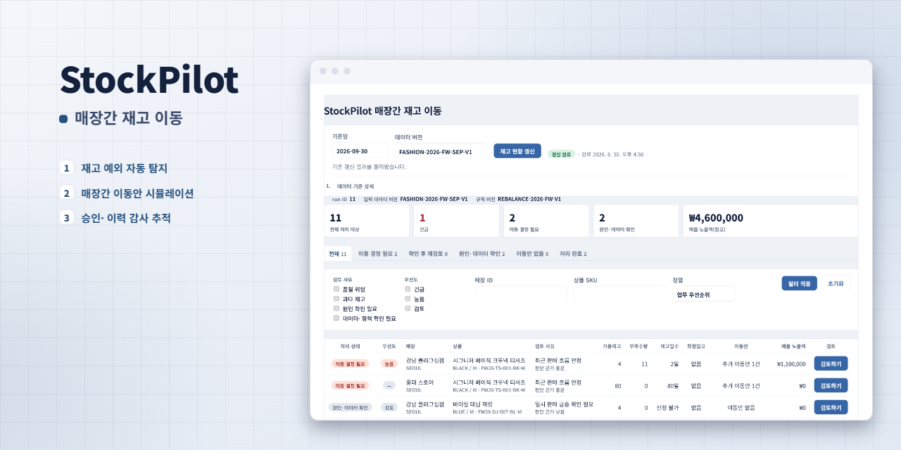
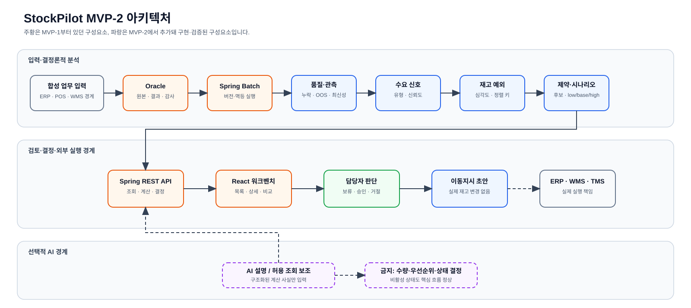

# StockPilot



> 패션 리테일의 매장별·SKU별 재고 불균형을 찾아, 담당자가 **근거를 확인하고
> 매장간 이동수량을 검토·승인**할 수 있게 만든 재고 배분 의사결정 지원 서비스

StockPilot은 “어느 매장에서 어떤 상품이 부족한가?”를 보여주는 데서 끝나지
않습니다. 최근 판매, 품절로 잘린 관측값, 행사, 입고 예정, 진행 중 이동, 매장별
보호재고와 이동경로를 함께 계산해 **검토 대상 → 공급 후보 → 이동 시나리오 → 사람의
결정 → ERP 이동요청 초안**까지 연결합니다.

## 시연 영상

<!-- GitHub 웹 에디터로 이 README를 열어 mp4 파일을 이 위치에 끌어다 놓으면, GitHub가
     자동으로 호스팅 링크를 만들어 아래에 삽입해 줍니다. 로컬 mp4 파일 경로를 직접
     참조하는 방식으로는 GitHub README에서 영상이 재생되지 않습니다. -->

재고 현황 갱신 → 필터링 → 근거 확인 → 승인까지, 담당자가 실제로 한 건을 처리하는
흐름을 1.5배속으로 담았습니다.

## 개요

### 주제

패션 리테일의 매장간 재고 이동(재배분) 의사결정을 지원하는 웹 서비스입니다. 재고
예외를 자동으로 탐지하고, 실행 가능한 이동안과 근거를 정리해 담당자의 검토·승인
흐름으로 연결합니다.

### 문제

패션 리테일 재고 배분은 단순히 “재고가 많은 매장에서 적은 매장으로 보낸다”로
해결되지 않습니다.

1. **검토 조합이 많습니다.** 상품·색상·사이즈와 매장의 조합이 커질수록 모든
   store-SKU를 같은 깊이로 사람이 확인하기 어렵습니다.
2. **판매량이 실제 수요와 다를 수 있습니다.** 품절일의 판매 0은 무수요가 아니고,
   행사나 한 번의 단체구매는 반복수요가 아닐 수 있습니다.
3. **수령 매장만 보면 안 됩니다.** 이동 후 공급 매장의 진열 최소수량·안전재고·향후
   수요가 무너지지 않는지도 함께 확인해야 합니다.
4. **물류·정책 제약이 존재합니다.** 재고 소유 주체, 허용 경로, 리드타임, 포장 배수,
   최소·최대 이동량과 수용 한도를 모두 통과해야 실제로 검토할 수 있는 안이 됩니다.
5. **추천과 승인 사이에 시간이 흐릅니다.** 동일 재고에 대한 동시 승인, 네트워크 재시도,
   오래된 분석 결과로 인한 중복·과다 이동을 막아야 합니다.

따라서 이 프로젝트의 목표는 수요를 정확히 예언하는 것이 아니라, 담당자가 오늘 볼
대상을 줄이고 **왜 이 대상이 올라왔는지, 어느 이동안이 가능한지, 승인해도 안전한지**를
검증 가능한 근거와 함께 제공하는 것입니다.

### 사용자

본사 재고 배분·보충 담당자(Allocator / Replenishment Planner)가 핵심 사용자입니다.

### 해결 방식

28일 판매·재고를 분석해 수요 신호와 데이터 신뢰도를 분리하고, 이동 제약을 통과한
후보와 low/base/high 시나리오를 제공합니다. 최종 산출물은 보류·승인·반려 이력과
승인 시 생성되는 ERP 이동요청 초안이며, 실제 이동 실행은 ERP/WMS/TMS의 책임으로
남겨둡니다.

| 문제 | StockPilot의 해결 |
|---|---|
| 모든 재고를 수작업으로 검토 | Spring Batch가 versioned snapshot을 읽고 예외·심각도·검토 우선순위를 산출 |
| 품절·급증으로 왜곡된 판매 관측 | `OOS_CENSORED`, 이벤트, 단일 대량거래를 분리하고 수요 신호와 신뢰도를 별도 저장 |
| 한 개 숫자로 이동량을 단정 | 무조치·보수적·기준·공격적 시나리오와 부작용 없는 수동 수량 시험 제공 |
| 실행 불가능한 추천 | 소유권·경로·리드타임·보호재고·포장·수용량을 검사하고 모든 탈락 사유 저장 |
| 추천 이후 데이터 변화 | 승인 트랜잭션에서 최신 근거와 활성 draft를 재조회해 stale 요청 거부 |
| 네트워크 재시도·동시 승인 | `Idempotency-Key`, 명시적 잠금 순서, unique constraint, append-only 이력으로 방어 |
| AI 결과를 업무 규칙으로 오인 | 계산과 AI 설명의 책임 경계를 분리하고 AI 장애가 핵심 흐름을 막지 않도록 설계 |

핵심 설계 원칙은 다음 네 가지입니다.

- **AI가 이동량을 정하지 않습니다.** 수요 신호, 우선순위, 후보 적격성, 수량과 상태는
  결정론적 Java 규칙이 계산하고 AI는 계산된 사실만 설명할 수 있습니다.
- **추천을 바로 집행하지 않습니다.** 담당자가 양쪽 매장의 전후 재고를 비교하고 수량을
  수정한 뒤 보류·승인·반려합니다.
- **승인도 다시 검증합니다.** 화면을 연 뒤 재고가 변했거나 다른 담당자가 먼저 승인한
  상황을 고려해 최신 근거를 트랜잭션 안에서 재계산합니다.
- **실제 기업 데이터가 아닙니다.** 모든 데이터는 `SYNTHETIC`, 정책과 임계값은
  versioned `ASSUMPTION`입니다.

### 주요 기능

- **분석 실행/재사용**: 동일 `(analysisDate, inputSnapshotVersion, ruleVersion)`의 완료
  결과를 재사용하고 실행 상태를 조회합니다.
- **업무 큐 요약과 업무 상태**: 전체·긴급·이동 결정 필요·원인 확인 대상 KPI 타일과,
  심각도와 분리된 5단계 업무 상태(이동 결정 필요/보류 중/원인·데이터 확인/이동안
  없음/처리 완료)로 오늘 볼 대상을 좁힙니다.
- **재고 예외 큐**: 예외 유형·심각도·수요 신호·신뢰도·품질 경고·업무 상태로 필터링하고
  업무 우선순위·심각도·신뢰도·부족수량·매출 영향 기준으로 정렬합니다.
- **근거 상세**: store-SKU별 28일 판매·재고, 행사, 확정 입고, 진행 중 이동, 적용
  정책을 한 화면에서 확인합니다.
- **후보·시나리오 비교**: 공급 후보의 통과/탈락과 탈락 사유를 담당자 용어로 보여주고,
  무조치·보수적·기준·공격적 네 시나리오를 양쪽 매장 관점으로 비교합니다.
- **수동 수량 시험**: 저장 없이 임의 수량의 제약 통과 여부와 전후 재고를 계산합니다.
- **보류·승인·반려**: 실행 가능한 후보를 열면 추천수량으로 자동 수량시험이 한 번
  실행되고, 승인은 별도 확인 대화상자로 매장·수량·전후 재고를 다시 보여준 뒤 멱등
  key와 최신 근거 검증을 거쳐 append-only 결정을 저장합니다.
- **처리 이력과 승인 근거**: 결정 이력, 승인 시점 근거 스냅샷, ERP 이동요청 초안을
  조회합니다.
- **AI 설명(선택)**: provider가 없어도 핵심 기능은 정상 동작하며, AI는 계산된 사실의
  설명만 담당합니다.

## 사용한 기술

### 기술 스택

| 구분 | 내용 |
|---|---|
| Backend | Java 21, Spring Boot 4.1, Spring Batch, Spring Data JPA, Flyway |
| Frontend | React 19, TypeScript, Vite, Testing Library, Vitest |
| Database / Infra | Oracle Database Free, Docker Compose, PowerShell 운영 스크립트 |
| 검증 규모 | Backend 527/527, Frontend 106/106, Flyway V1~V16, 6개 합성 골든 시나리오 |

### 아키텍처



[draw.io 편집 원본](docs/diagrams/stockpilot-architecture.drawio) ·
[SVG 원본](docs/diagrams/stockpilot-architecture.svg)

Frontend와 Backend는 로컬 프로세스로 실행하고 Oracle Database Free만 Docker Compose로
격리했습니다. Redis·Kafka·별도 인증 서버를 넣지 않고, 현재 규모에서 필요한 원자성·
멱등성·감사 가능성을 RDB 트랜잭션과 constraint로 해결했습니다.

| 영역 | 책임 |
|---|---|
| React Frontend | 분석 실행/폴링, 예외 목록·상세, 시나리오 비교, MANUAL 시험, 결정·이력 표시 |
| Spring MVC API | run-bound 조회, RFC 9457 오류 응답, simulation·decision command 경계 |
| Spring Batch | versioned 입력을 고정 8개 bulk query로 읽고 계산 결과를 원자적으로 저장 |
| Pure Java Domain | 관측 통계, 수요 신호, 재고 projection, 후보 제약, scenario와 승인 검증 |
| Spring Data JPA | 분석 결과 조회, 추천·결정·승인 근거·초안 영속화와 명시적 lock |
| Oracle + Flyway | 입력·산출·감사 데이터, FK/UK/CHECK, V1~V16 schema history |
| Optional AI Boundary | Java가 만든 구조화 사실의 설명만 담당. 비활성·실패 시에도 핵심 흐름 정상 |

**읽기 경로와 쓰기 경로를 분리한 이유** — 분석 경로는 JDBC bulk 조회 → 메모리의 순수
Java 계산 → 한 트랜잭션의 결과 저장 순서로 고정한 Batch 작업입니다. 조회 경로는 완료된
`analysisRunId`에 묶인 read model만 반환해 어떤 근거로 나온 결과인지 항상 추적할 수
있습니다. 승인 경로는 추천 행을 잠근 뒤 공급 재고를 잠그고 최신 근거를 다시 읽어
decision·approval basis·draft를 원자적으로 쓰는, 짧고 강한 consistency가 필요한
command입니다.

### 설계 포인트

- **계산 로직을 프레임워크에서 분리**: 수요 관측, 신호 분류, 재고 projection, 후보
  평가, scenario와 수동 수량 검증을 Spring Bean·JPA Entity가 아닌 순수 Java 객체로
  구현해 Oracle·Spring Context 없이도 경계값을 빠르게 검증합니다.
- **설명 가능한 규칙과 버전**: 단일 불투명 점수 대신 심각도 → 실행 가능한 후보 →
  신뢰도 → 부족수량 → 매출 영향의 정렬 키를 쓰고, 후보 탈락 시 모든 제약 위반 사유를
  저장하며, 결과에 입력 snapshot·rule·candidate version을 함께 남깁니다.
- **Batch의 bounded I/O와 원자성**: 입력 규모가 늘어나도 store-SKU마다 SQL이 추가되는
  N+1 구조를 피하려 Batch 입력을 정확히 8개 bulk query로 고정하고, 계산은 메모리에서
  완료한 뒤 하나의 트랜잭션으로 저장합니다.
- **승인 API의 멱등성·동시성·stale 방어**: `Idempotency-Key`로 재전송을 구분하고,
  추천 → 공급 재고 순서로 lock한 뒤 최신 근거를 재계산해야만 commit합니다.
- **AI를 핵심 경로 밖에 둔 이유**: 같은 입력에서 같은 수량과 사유가 나와야 감사할 수
  있으므로, AI는 수량·적격성·우선순위·상태를 만들거나 override할 수 없습니다.

## ERD

ERD는 데이터를 세 층으로 나눴습니다.

1. **입력 사실과 정책**: 상품·매장, 일별 판매·재고, 행사, 입고, 진행 중 이동, 경로와
   매장-SKU 정책
2. **분석 결과**: 분석 실행, 재고 지표, 품질 플래그, 이동 후보와 시나리오
3. **사람의 결정과 감사**: append-only 결정, 승인 시점 근거, ERP 이동요청 초안


### 모델링에서 중요하게 본 점

- `(analysisDate, inputSnapshotVersion, ruleVersion)`을 분석 실행의 식별 기준으로 삼아 새
  입력·규칙이 과거 결과를 덮어쓰지 않게 했습니다.
- 한 추천에 여러 scenario를 자식으로 두어 “추천량 하나”와 “비교 가능한 여러 결과”를
  분리했습니다.
- 탈락 후보도 삭제하지 않고 사유를 별도 행으로 보존해, 결과가 없는 이유까지 설명할 수
  있게 했습니다.
- 결정은 update가 아니라 sequence 기반 append-only 이력으로 저장합니다.
- 승인 시 계산 근거를 `SP_APPROVAL_BASIS`에 동결해 이후 정책·재고가 변해도 당시 승인
  근거를 재현할 수 있게 했습니다.
- DB는 FK, unique, check constraint를 최종 방어선으로 사용하고 애플리케이션 검증과
  역할을 나눴습니다.

오류 코드 사전 등 부가 테이블을 포함한 전체 schema와 자연키·FK·CHECK는
[`knowledge/data-model.md`](knowledge/data-model.md)에 정리했습니다.

## 트러블슈팅

### 1. 소수 정밀도를 늘렸는데도 이동수량이 1개씩 틀리던 문제

**문제**
7일 판매량을 일평균 `BigDecimal`로 나눈 뒤 다시 목표 일수만큼 곱했습니다. 예를 들어
`1 / 7 = 0.1428571429`를 다시 7일에 곱하면 `1.0000000003`이 되어 `ceil` 경계에서 실제보다
1개 많은 이동량이 나올 수 있었습니다.

**원인**
소수점 자릿수가 부족한 것이 아니라, 원래 정수였던 판매수량을 유한 소수로 바꿨다가
다시 정수로 복원하는 계산 구조 자체가 오차를 만들었습니다.

**해결**
자릿수를 더 늘리는 대신 나눗셈을 제거하고 정수 올림 나눗셈
`(numerator + denominator - 1) / denominator`으로 식을 바꿨습니다. 해당 경계값을 회귀
테스트로 추가하고 기존 골든 시나리오 결과가 보존되는지도 함께 확인했습니다.

**배운 점**
수량 도메인에서는 “정밀한 소수”보다 **단위를 보존하는 정수식과 반올림 시점의 명시**가
더 안전하다는 점을 확인했습니다.

관련 코드: [`RebalanceCalculation.java`](backend/src/main/java/com/bapegg/stockpilot/rebalance/RebalanceCalculation.java)

### 2. 통합테스트가 하나도 실행되지 않아도 성공으로 보이던 문제

**문제**
Oracle 환경변수가 없으면 Oracle 전용 테스트가 조건부 skip됩니다. 기존 검증은 Gradle
종료 코드만 확인했기 때문에 통합테스트가 전부 skip돼도 “전체 테스트 통과”라고 오해할
수 있었습니다.

**원인**
프로세스 성공과 테스트 충분성을 같은 것으로 취급했습니다. 빌드 도구 입장에서는 조건부
skip도 정상 종료지만, 프로젝트 검증 목표에는 실패였습니다.

**해결**
`scripts/local.ps1 test`가 자격증명 존재 여부를 먼저 검사하고, Gradle이 생성한 JUnit XML을
직접 집계해 `total > 0`, `skipped = 0`, `failures = 0`, `errors = 0`을 강제하도록 했습니다.
자격증명 누락과 강제 skip을 실제로 주입해 guard가 실패하는지까지 테스트했습니다.

**배운 점**
CI/CD의 초록색 결과도 검증 대상입니다. **명령의 exit code와 실제로 검증된 범위는 다르다**는
전제로 실행 증거를 다시 확인하는 습관을 얻었습니다.

관련 코드: [`scripts/local.ps1`](scripts/local.ps1)

### 3. 같은 재고가 중복 승인되거나 오래된 추천이 승인될 수 있던 문제

**문제**
두 담당자가 같은 공급 재고를 동시에 승인하거나, 응답을 못 받은 client가 같은 요청을
재전송하거나, 화면을 오래 열어둔 사이 새 분석 run이 완료될 수 있습니다. 단순 CRUD 저장은
결정 중복, 공급량 초과, stale 승인을 막지 못합니다.

**해결**

1. `Idempotency-Key`와 정규화한 request fingerprint로 동일 요청 재전송은 replay하고 다른
   payload 재사용은 거부했습니다.
2. 모든 승인에서 추천 행 → 공급 재고 snapshot 순서로 lock해 교착 가능성을 줄였습니다.
3. lock 후 최신 run/version, 재고·입고·진행 중 이동·활성 draft를 다시 읽어 공급 가능량을
   재계산했습니다.
4. 근거가 달라졌으면 `STALE_RECOMMENDATION` 409로 아무 것도 쓰지 않았습니다.
5. 성공 시 decision·approval basis·transfer draft를 한 트랜잭션으로 저장하고 DB unique
   constraint를 마지막 방어선으로 뒀습니다.

**검증**
동시 승인, 멱등 replay, 동일 key의 다른 payload, lock timeout, 중간 insert 실패 시 전체
rollback을 Oracle 통합테스트로 고정했습니다.

**배운 점**
동시성 문제는 `synchronized` 하나로 해결하는 것이 아니라 **업무 식별자, 잠금 순서,
최신성 재검증, 원자적 저장, DB 제약**을 함께 설계해야 한다는 점을 익혔습니다.

관련 코드:
[`ApprovalTransactionFacade.java`](backend/src/main/java/com/bapegg/stockpilot/approval/ApprovalTransactionFacade.java),
[`ApprovalTransactionExecutor.java`](backend/src/main/java/com/bapegg/stockpilot/approval/ApprovalTransactionExecutor.java),
[`CurrentApprovalBasisLoader.java`](backend/src/main/java/com/bapegg/stockpilot/approval/CurrentApprovalBasisLoader.java)

### 4. 공유 개발 DB를 오래 실사용하니 통합테스트가 스스로 깨지던 문제

**문제**
Spring Batch 메타데이터를 "이 입력 버전에 대한 job instance는 정확히 1개"라고 가정해
조회하는 테스트와, 트랜잭션 밖에서 lazy 연관관계에 접근하는 테스트 헬퍼가 있었습니다.
둘 다 처음에는 통과했지만, 같은 Oracle을 공유하는 개발 DB에서 화면을 통해 분석을
반복 실행하고 실제 승인을 몇 번 만들자 실패로 바뀌었습니다.

**원인**
테스트가 "이 DB에는 이 테스트가 만든 데이터만 있다"는 격리를 실제로 보장하지 않고
암묵적으로 가정했습니다. 처음 작성 시점에는 우연히 참이었을 뿐입니다.

**해결**
배치 메타데이터 조회는 최신 job instance를 명시적으로 선택하도록 바꾸고, 트랜잭션 밖
lazy 접근은 필요한 필드까지 fetch join으로 미리 가져오도록 헬퍼를 수정했습니다.

**배운 점**
통합테스트의 "지금 통과한다"는 "격리를 보장한다"와 다릅니다. 공유 DB를 쓰는 이상
**정확히 몇 건이 있다는 가정 대신 최신·특정 조건으로 좁히는 조회**를 기본값으로 삼아야
합니다.

### 5. 로컬 개발 DB가 최신 Flyway 마이그레이션과 조용히 어긋나 있던 문제

**문제**
장시간 켜둔 로컬 Oracle 컨테이너에서 백엔드가 기동 직후 `Migration checksum mismatch for
migration version 7`로 죽었습니다. 파일 시스템의 V7 마이그레이션은 git 기준 정상이었는데도
DB에 기록된 체크섬과 달랐습니다.

**원인**
Flyway는 "이미 적용된 마이그레이션 파일이 이후에 바뀌었는가"만 체크섬으로 검증합니다. 이
컨테이너는 V7이 지금과 다른 내용이던 시점에 이미 마이그레이션을 적용한 뒤, 이후 커밋에서
V7 내용이 바뀌었는데도 DB는 갱신되지 않은 채로 오래 유지된 상태였습니다.

**해결**
`docker compose down -v`로 명명 볼륨까지 완전히 지우고 컨테이너를 새로 만들어 V1~V16을
처음부터 다시 적용했습니다(모든 데이터가 SYNTHETIC 데모 데이터이므로 안전). 이 과정에서
추가로 발견한 두 번째 문제 — 데모 영상용 확장 마이그레이션(V16)이 실제로 존재하지 않는
상품 SKU와 매장 ID를 참조해 `ORA-02291`/`ORA-01400` 제약 위반으로 실패하는 것 — 도 함께
고쳤습니다: 참조하던 6개 상품을 마이그레이션 안에 직접 추가하고, 지어낸 매장 ID를 실제
시드 데이터의 매장 ID로 교정했습니다.

**배운 점**
"파일은 git과 일치한다"와 "이 DB가 그 파일 그대로 적용됐다"는 서로 다른 명제입니다.
오래 켜둔 로컬 dev 환경일수록 스키마 히스토리가 코드보다 먼저 신뢰를 잃을 수 있으므로,
**의심스러우면 볼륨을 통째로 재생성해 처음부터 재현되는지 확인**하는 편이 diff를 추적하는
것보다 빠르고 확실했습니다.

관련 코드: [`V16__expand_mvp2_demo_scenario_v2.sql`](backend/src/main/resources/db/migration/V16__expand_mvp2_demo_scenario_v2.sql)

## 검증 결과

2026-08-31 기준 실제 실행이 확인된 결과입니다.

| 검증 | 결과 |
|---|---|
| Oracle Backend 전체 | 527/527 통과, skip·실패·오류 0 |
| Flyway | V1~V16 처음부터 clean migration·validation 통과 |
| Frontend | 106/106 통과, `tsc --noEmit` clean, production build 통과 |
| 목록 query ceiling | size=1/size=100 동일 statement 수(9), 업무 상태·정렬·요약 확장 후에도 ceiling 이내 |
| 실제 분석 실행 | 확장 데모 스냅샷(6개 상품 × 9개 매장) 기준 분석을 실제로 실행해 54건의 처리 대상이 정상 산출됨을 확인 |
| Browser 수용 시나리오 | 재고 현황 갱신 → 업무 요약/업무 상태 탭 → 검토하기 → 후보 자동 선택·자동 수량시험 → 승인 확인 대화상자 → 승인 완료까지, 실제 Oracle 기반 실행 결과로 전체 흐름 확인 |
| Repository | `git diff --check` exit 0 |

검증 script는 Oracle을 임의 생성·삭제하지 않습니다. full test는 실행 중인 Oracle과
non-empty credential, 실제 JUnit XML의 zero skip을 모두 요구합니다.

## 로컬 실행

### 요구 환경

- Java 21
- Node.js 22 LTS 이상과 pnpm
- Docker Desktop

### 최초 설정과 DB

```powershell
.\scripts\local.ps1 setup
.\scripts\local.ps1 seed-check
.\scripts\local.ps1 db-up
.\scripts\local.ps1 db-status
```

### 애플리케이션 실행

Backend:

```powershell
.\scripts\local.ps1 backend
```

다른 터미널에서 Frontend:

```powershell
pnpm --dir frontend install --frozen-lockfile
.\scripts\local.ps1 frontend
```

- Frontend: `http://localhost:5173`
- Backend: `http://localhost:8081`

### 전체 검증

```powershell
.\scripts\local.ps1 seed-check
.\scripts\local.ps1 test-db-free
.\scripts\local.ps1 db-status
.\scripts\local.ps1 test
git diff --check
```

## 제품 경계와 한계

| 주체 | 책임 |
|---|---|
| StockPilot | 데이터 검사, 검토 대상 축소, 결정론적 계산, 제약 확인, scenario 비교, ERP 이동요청 초안 |
| 재고 배분 담당자 | 판매 맥락 확인, 최종 수량 수정, 보류·승인·반려 |
| ERP/WMS/TMS | 실제 이동지시 접수, 피킹·출고·운송·입고와 재고 반영 |
| AI | Java가 계산한 사실의 선택적 설명. 수량·우선순위·상태 결정 금지 |

- 실제 LLM provider adapter는 구현하지 않았습니다.
- 인증/인가, 담당자별 업무 할당과 외부 ERP/WMS/TMS 연동은 범위 밖입니다.
- 운영 scheduler, 정지된 `RUNNING` 복구와 첫 JobInstance 시작 경합의 운영 정규화는
  구현하지 않았습니다.
- Batch는 합성 규모에서 검증한 단일 Tasklet이며 대규모 운영 성능을 주장하지 않습니다.
- 모든 데이터는 합성 데이터이며 정책과 임계값은 특정 기업의 실제 정책이 아닙니다.

## 설계 참고 자료

- [Oracle Retail 재배분 workflow](https://docs.oracle.com/en/industries/retail/retail-inventory-planning-optimization-cloud/26.1.101.0/ipoio/workflow1.htm) —
  Batch 결과를 사람이 검토·수정·승인하는 흐름의 참고
- [Oracle Retail 매장 이동](https://docs.oracle.com/en/industries/retail/store-inventory-op-cloud/latest/rsoug/transfers.htm) —
  요청·승인·출고·입고 책임 경계의 참고

특정 기업의 내부 시스템이나 절차를 그대로 반영한 것은 아니며, 공개된 일반적인 리테일
재배분 업무 흐름을 참고해 설계했습니다.
