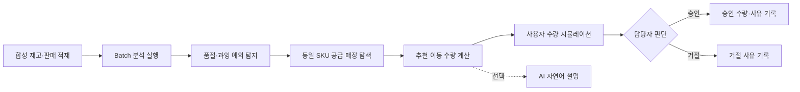

# StockPilot

> 패션 상품의 판매·재고 데이터를 분석해 **먼저 확인할 재고 예외와 매장 간 이동 대안**을 제시하는 재고 운영 의사결정 지원 시스템

## 프로젝트 개요

| 항목 | 내용 |
|---|---|
| 프로젝트 주제 | 패션 재고 예외 탐지·재배분 의사결정 지원 |
| 대상 사용자 | 상품·재고 운영 담당자, 매장 배분 담당자 |
| 핵심 문제 | 많은 SKU와 매장 중 어떤 재고 문제를 먼저 확인하고 어디에서 재고를 가져올지 빠르게 판단하기 어렵다. |
| 해결 방식 | Oracle의 판매·재고 데이터를 Batch로 분석하고, Java가 계산한 이동 대안을 화면에서 비교·승인·거절한다. |
| 개발 범위 | 1~2일 MVP, 하나의 Golden Scenario를 처음부터 끝까지 구현 |
| 데이터 | 실제 기업 데이터가 아닌 `SYNTHETIC` 데모 데이터 |
| 업무 정책 | 실제 기업 정책이 아닌 `ASSUMPTION` 가정값 |

StockPilot은 전체 ERP나 실제 물류 실행 시스템을 만드는 프로젝트가 아닙니다. 담당자가 매일 확인해야 할 재고 예외를 줄이고, 계산 근거가 있는 의사결정을 지원하는 작은 업무 시스템입니다.

## 대상 사용자가 겪는 문제

재고 담당자는 모든 상품과 매장을 한 건씩 확인할 수 없습니다.

- 한 매장에서는 곧 품절될 상품이 있다.
- 다른 매장에는 같은 상품이 판매되지 않은 채 쌓여 있다.
- 이동할 수량을 잘못 정하면 품절 문제를 해결하지 못하거나 출발 매장에 새로운 부족이 생긴다.
- 담당자가 왜 해당 수량을 선택했는지 기록이 남아야 한다.

StockPilot은 **탐지 → 추천 → 시뮬레이션 → 결정 기록**을 하나의 업무 흐름으로 연결합니다.

## 주요 기능

| 기능 | 설명 |
|---|---|
| Oracle Seed | 버전 관리되는 합성 상품·매장·재고·판매 데이터를 Oracle에 적재 |
| Batch 분석 | 같은 분석일과 규칙 버전으로 중복 결과가 생기지 않는 재고 분석 |
| 예외 탐지 | 재고 보유일수를 기준으로 품절 위험과 과잉재고 분류 |
| 우선순위 | 담당자가 먼저 확인할 품절 위험을 `CRITICAL`, `HIGH`로 구분 |
| 재배분 추천 | 같은 SKU의 수요 매장과 공급 가능 매장을 연결하고 이동 수량 계산 |
| 시뮬레이션 | 사용자가 수량을 바꿔 이동 전후 양쪽 매장의 재고 보유일수 비교 |
| 승인·거절 | 선택 수량, 상태, 사유, 담당자 표시와 시각을 감사 이력으로 보존 |
| AI 설명 | Java가 계산한 결과만 자연어로 설명하며 수량과 상태를 결정하지 않음 |

## Golden Scenario

분석 기준일은 `2026-08-25`이고 대상 SKU는 `SKU-CAP-BLACK-FREE`입니다.

| 매장 | 판매 가능 재고 | 최근 7일 판매 | 일평균 판매 | 재고 보유일수 | 판정 |
|---|---:|---:|---:|---:|---|
| 강남 | 5 | 28 | 4.00 | 1.25일 | 품절 위험 |
| 홍대 | 40 | 4 | 0.57 | 70.00일 | 과잉재고 |
| 성수 | 11 | 9 | 1.29 | 8.56일 | 정상 |

업무 규칙에 따라 홍대에서 강남으로 **25개 이동**하는 대안을 추천합니다. 숫자는 [`knowledge/business-rules.md`](knowledge/business-rules.md)의 데모 가정에서 계산되며 실제 기업 정책이 아닙니다.

## 업무 프로세스



## 시스템 아키텍처

Backend와 Frontend는 빠른 수정과 디버깅을 위해 로컬에서 실행합니다. 데이터베이스만 Docker로 격리해 PC마다 같은 Oracle 환경을 사용합니다.

로컬 DB는 Oracle Database Free를 담은 커뮤니티 유지보수 이미지 [`gvenzl/oracle-free:23.26.2-slim-faststart`](https://github.com/gvenzl/oci-oracle-free/blob/main/README.md)를 사용합니다. 개발 환경이 예고 없이 바뀌지 않도록 `latest` 대신 검증한 버전을 고정했습니다.


[draw.io 편집 원본](docs/diagrams/stockpilot-architecture.drawio) · [SVG 원본](docs/diagrams/stockpilot-architecture.svg)

수정할 때는 [diagrams.net](https://app.diagrams.net/)에서 `File → Open from → Device`를 선택하고 `.drawio` 파일을 열면 됩니다.

MVP에는 Redis, Kafka, 별도 인증 서버가 필요하지 않습니다. 필요한 서버가 추가되는 경우에만 Compose 서비스로 확장합니다.

## ERD

원본 데이터, Batch 계산 결과, 담당자 결정을 분리해 규칙이 바뀌어도 과거 판단의 근거를 추적할 수 있습니다.


[draw.io 편집 원본](docs/diagrams/stockpilot-erd.drawio) · [SVG 원본](docs/diagrams/stockpilot-erd.svg)

업무 테이블 8개와 컬럼 54개에는 Oracle Comment를 적용했습니다. 일반 항목은 `상품명`, `판매일`, `재고 보유일수`처럼 짧은 명사형으로 기록하고 코드 항목만 허용값과 의미를 함께 표시합니다.

컬럼, 제약조건과 데이터 적재 절차는 [`knowledge/data-model.md`](knowledge/data-model.md)에 기록합니다. Spring Batch 자체 메타데이터 테이블은 업무 ERD에서 제외했습니다.

## 데이터 수집·적재 절차

현재 MVP는 외부 사이트를 크롤링하거나 실제 기업 데이터를 수집하지 않습니다.


- 원본: `data/seed/*.csv`
- 자동 검증: `scripts/validate-seed.ps1`
- Schema: `V1__create_stockpilot_schema.sql`
- Seed: `V2__load_synthetic_seed.sql`
- Spring Batch 메타데이터: `V3__create_spring_batch_metadata.sql`
- 테이블·컬럼 Comment: `V4__add_domain_comments.sql`

적용된 Migration은 수정하지 않고 변경이 필요하면 다음 버전 파일을 추가합니다.

## 핵심 설계 결정

### 계산과 AI의 책임 분리

판매 가능 재고, 일평균 판매량, 재고 보유일수, 예외 분류와 추천 수량은 Java가 같은 입력에 같은 결과를 내도록 계산합니다. AI는 이 결과를 읽기 쉽게 설명할 수 있지만 수량 생성, 승인 변경 또는 DB 직접 쓰기를 할 수 없습니다.

### Oracle을 실제 검증 대상으로 사용

H2로 대체하지 않습니다. Oracle 고유 SQL, 제약조건과 Flyway Migration을 Docker의 Oracle Database Free에서 검증합니다.

### 원본·계산·판단 분리

재고와 판매는 원본 근거, `SP_INVENTORY_METRIC`은 규칙 버전별 계산 결과, `SP_REBALANCE_DECISION`은 사람의 최종 판단을 보존합니다.

### 작은 Vertical Slice

마이크로서비스와 복잡한 인프라 대신 하나의 SKU와 세 매장으로 전체 흐름이 끝까지 동작하는 것을 완료 기준으로 삼습니다.

## 기술 스택

| 영역 | 기술 | 선택 이유 |
|---|---|---|
| Backend | Java 21, Spring Boot 4.1 | 명시적인 업무 규칙과 엔터프라이즈 REST API |
| Batch | Spring Batch 6 | 분석 실행 이력과 재시작 가능한 처리 구조 |
| Persistence | Spring Data JPA, Oracle JDBC | 트랜잭션과 관계형 데이터 무결성 |
| Schema | Spring Boot Flyway Starter, Flyway Oracle | Schema·Seed·Batch 테이블 변경 이력 관리 |
| Database | Oracle Database Free 23ai (`23.26.2`) | 실제 Oracle SQL과 제약조건 검증 |
| Frontend | React 19, TypeScript 5.9, Vite 8 | 예외 목록과 시뮬레이션 중심의 작은 업무 UI |
| Test | JUnit 5 | 계산 규칙 단위 테스트와 Oracle 통합 검증 |
| Local infra | Docker Compose | Oracle 버전과 데이터 볼륨 재현 |

## 프로젝트 구조

```text
fashion-inventory-ops/
├─ README.md                         포트폴리오와 실행 안내
├─ compose.yml                       Oracle Database 로컬 인프라
├─ .env.example                      DB·AI 설정 템플릿
├─ scripts/
│  ├─ local.ps1                      설정·DB·앱 실행 명령
│  └─ validate-seed.ps1              합성 데이터 검증
├─ backend/
│  ├─ build.gradle.kts
│  └─ src/main/resources/
│     ├─ application.yml
│     └─ db/migration/               Oracle Schema·Seed·Batch Migration
├─ frontend/                         React 업무 화면
├─ data/seed/                        버전 관리되는 합성 CSV
├─ docs/diagrams/                    README용 SVG와 draw.io 편집 원본
├─ knowledge/
│  ├─ project.md                     제품 범위와 완료 조건
│  ├─ business-rules.md              계산식과 데모 가정값
│  ├─ data-model.md                  상세 ERD와 데이터 적재 절차
│  ├─ state/                         현재 작업과 실제 구현 상태
│  └─ worklogs/                      역할 간 압축 인계 기록
└─ .agents/skills/                   최소 문서 재개·인계 절차
```

## 로컬 실행

### 요구 환경

- Java 21
- Node.js 22 LTS 이상과 pnpm
- Docker Desktop

### 1. 로컬 설정 생성

```powershell
.\scripts\local.ps1 setup
```

루트에 Git에서 제외되는 `.env`가 생성됩니다. Oracle 관리자와 앱 사용자 비밀번호는 무작위로 만들어지며, 추후 LLM API Key도 이 파일에만 추가합니다.

### 2. 합성 데이터 확인

```powershell
.\scripts\local.ps1 seed-check
```

### 3. Oracle 시작

Docker Desktop을 실행한 뒤 다음 명령을 사용합니다.

```powershell
.\scripts\local.ps1 db-up
.\scripts\local.ps1 db-status
```

최초 실행은 Oracle 이미지를 내려받기 때문에 시간이 걸릴 수 있습니다. 데이터는 Docker Volume에 유지됩니다.

### 4. Backend 시작

새 터미널에서 실행합니다.

```powershell
.\scripts\local.ps1 backend
```

Backend가 Oracle에 연결되면 Flyway가 Schema, Seed와 Spring Batch 메타데이터를 순서대로 적용합니다.

### 5. Frontend 시작

다른 터미널에서 실행합니다.

```powershell
corepack enable
pnpm --dir frontend install --frozen-lockfile
.\scripts\local.ps1 frontend
```

### 종료

```powershell
.\scripts\local.ps1 db-down
```

`db-down`은 컨테이너만 내리고 Oracle 데이터 Volume은 보존합니다.

## 현재 구현 상태

| 구분 | 상태 |
|---|---|
| 프로젝트 정의·업무 규칙 | 완료 |
| ERD·Oracle Schema·Seed Migration | Oracle 적용 검증 완료 |
| Docker Compose·로컬 설정 | Oracle Healthy 상태 검증 완료 |
| Backend·Frontend 실행 뼈대 | Backend 기동·Frontend 빌드 검증 완료 |
| Batch 분석·REST API | 미구현 |
| 예외 목록·시뮬레이션 화면 | 미구현 |
| 승인·거절·AI 설명 | 미구현 |

완성된 기능과 계획된 기능을 구분해서 기록합니다. 실제 검증 상태는 [`knowledge/state/implemented-state.md`](knowledge/state/implemented-state.md)가 기준입니다.

## 데이터 고지

이 저장소의 상품, 매장, 재고와 판매 데이터는 모두 데모를 위해 만든 `SYNTHETIC` 데이터입니다. 계산 임계값과 목표 재고일수는 `ASSUMPTION`이며 특정 기업의 실제 데이터나 내부 정책을 구현했다고 주장하지 않습니다.
