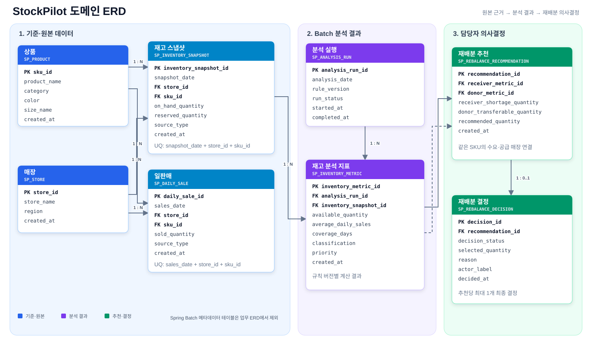

# StockPilot

> 패션 리테일 재고 배분 담당자가 **수요 신호와 데이터 신뢰도를 확인하고,
> 실행 가능한 재배분 시나리오를 비교**하도록 돕는 재고 예외 의사결정 워크벤치

`MVP-1` Oracle Vertical Slice는 구현·검증돼 있습니다. `MVP-2`는 28일 수요
신호, 입고 예정, 이동 제약과 복수 시나리오를 추가하는 **승인된 데모 설계
기준선**이지만 아직 코드나 DB Schema로 구현되지 않았습니다.

## 왜 이 문제를 다루는가

패션 리테일은 상품·색상·사이즈와 매장 조합이 많아 모든 재고 위치를 같은 깊이로
검토하기 어렵습니다. 단순 기간 평균만 보면 하루의 대량구매를 반복수요로
오인하거나, 품절로 판매가 멈춘 상품을 무수요로 오인할 수 있습니다. 실제
재배분 판단에는 판매 외에도 이벤트, 거래 특성, 입고 예정, 진행 중 이동,
재고 소유권, 경로와 리드타임이 필요합니다.

StockPilot의 목표는 수요를 정확히 예언하거나 이동을 자동 집행하는 것이
아닙니다. 담당자가 오늘 볼 대상을 줄이고 다음 판단에 필요한 근거를 한곳에
모읍니다.

```text
수요 신호·품질 분류
  → 재고 예외 우선순위
  → 공급 후보와 탈락 사유
  → 무조치·보수적·기준·공격적·수동 시나리오
  → 사람의 보류·승인·거절
  → ERP 이동지시 초안
```

## 제품 경계

| 항목 | 정의 |
|---|---|
| 핵심 사용자 | 본사 재고 배분·보충 담당자(Allocator/Replenishment Planner) |
| StockPilot | 데이터 검사, 검토 대상 축소, 결정론적 계산, 제약 확인, 시나리오 비교, 이동지시 초안 |
| 사람 | 맥락 확인, 최종 수량 수정, 보류·승인·거절 |
| ERP/WMS/TMS | 실제 이동지시 접수, 피킹·출고·운송·입고 |
| AI | Java가 계산한 사실의 선택적 설명; 수량·우선순위·상태 결정 금지 |

모든 문서와 화면은 다음 고지를 유지합니다.

> `SYNTHETIC` 데이터 · `ASSUMPTION` 데모 정책 · 실제 F&F 정책 또는 검증된
> 산업 표준이 아님

- 품절 **예측**이 아니라 품절 위험 **신호 탐지**입니다.
- 최적 이동량이 아니라 복수 재배분 **시나리오 비교**입니다.
- 판단 자동화가 아니라 **판단 준비 자동화**입니다.
- 실제 물류 시스템이 아니라 **ERP 이동지시 초안**까지 다룹니다.

## 구현된 것과 다음 단계

| 영역 | MVP-1 현재 구현 | MVP-2 상태 |
|---|---|---|
| 입력 | 7일 판매, 분석일 재고, 2개 합성 데이터셋 | Phase 1 구현: 28일 판매·재고, 거래, 이벤트, 입고, 진행 중 이동, 경로, 정책 Schema/Seed |
| 분석 | coverage 기반 품절 위험·과잉·정상 분류 | Phase 2 미구현: 수요 신호·신뢰도·품질 플래그와 재고 예외 분리 |
| 이동 | 같은 SKU donor와 단일 추천량 | Schema 구현, Java 미구현: 후보 제약·탈락 사유, low/base/high 수량 |
| 사용자 흐름 | 목록·상세·수동 시뮬레이션·승인/거절 | 미구현: 필터, 28일 근거, 5개 시나리오, 보류·감사 이력 |
| 실행 경계 | 결정 기록, 실제 재고 미변경 | Draft Schema만 구현: 승인 시 생성 동작과 외부 전송은 미구현 |
| AI | disabled/unconfigured/provider-not-implemented 응답 경계 | 구조화된 계산 사실 설명; 실제 문서가 있을 때만 RAG 검토 |

현재 구현에는 Spring Batch 분석, 분석 실행 API, 예외 목록·상세 API,
side-effect 없는 시뮬레이션, 결정 저장, React 화면과 AI-disabled 설명 endpoint가
포함됩니다. LLM provider adapter는 구현되지 않았습니다.

## MVP-2 수요 신호

| Signal | 의미 | 승인된 데모 수량 정책 |
|---|---|---|
| `DATA_INSUFFICIENT` | 출시·관측 데이터 부족 | 무조치와 수동 검토만 |
| `KNOWN_EVENT` | 행사·프로모션·가격 변경과 관련 | 정량 uplift가 완전할 때만 3개 시나리오 |
| `UNEXPLAINED_SPIKE` | 알려진 이벤트 없이 특정 일·거래 집중 | 단일 추천 금지, 원인 확인 |
| `INTERMITTENT` | 판매일과 활성 주가 드문 수요 | 무조치와 제한적 수동 검토 |
| `STABLE_REPEAT` | 여러 주에 반복되고 변동이 허용 범위 안 | 보수적·기준·공격적 시나리오 |
| `VARIABLE` | 충분한 데이터가 있으나 안정 유형 아님 | 비교만 제공하고 기본 추천·자동 선택 없음 |

신뢰도는 `HIGH/MEDIUM/LOW/NONE` 레이블이며 예측 확률이 아닙니다. 임계값,
백분위와 반올림 순서는
[`knowledge/business-rules.md`](knowledge/business-rules.md)에만 정의합니다.
모든 값은 버전 관리되는 `ASSUMPTION`이며 실제 F&F 정책이나 검증된 산업
표준이 아닙니다.

## 합성 검증 시나리오

기존 `2026-08-25` MVP-1 Golden Scenario(홍대→강남 25개)는 회귀 기준으로
보존합니다. MVP-2 Phase 1은 다음 최소 여섯 사례의 입력을 추가했습니다. 기대
결과 계산은 Phase 2 이후에 구현합니다.

| ID | 입력 상황 | 기대 결과 |
|---|---|---|
| `GS-01` | 4주 안정 수요 + 여유 donor | `STABLE_REPEAT`, 3개 시나리오 |
| `GS-02` | 정량 uplift가 있는 프로모션 | `KNOWN_EVENT`, 이벤트 기반 시나리오 |
| `GS-03` | 하루 판매 대부분이 한 건 | `UNEXPLAINED_SPIKE`, 추천 금지 |
| `GS-04` | 품절 때문에 판매 0 | `OOS_CENSORED`, 무수요 오분류 방지 |
| `GS-05` | 확정 입고가 부족을 해소 | `INBOUND_ALREADY_COVERS` |
| `GS-06` | 소유권·경로·리드타임 위반 | 후보 탈락과 정확한 reason code |

데모 상품·매장·판매·재고는 `SYNTHETIC`이며 특정 기업의 실제 데이터가
아닙니다.

## 아키텍처


[draw.io 편집 원본](docs/diagrams/stockpilot-architecture.drawio) ·
[SVG 원본](docs/diagrams/stockpilot-architecture.svg)

Backend와 Frontend는 로컬에서 실행하고 Oracle Database Free만 Docker로
격리합니다. 현재 구현은 Java 21, Spring Boot 4.1, Spring Batch 6, Oracle,
React 19, TypeScript 5.9와 Vite 8을 사용합니다. Redis, Kafka, 별도 인증 서버는
승인된 범위에 없습니다.

현재 Batch는 합성 규모에서 검증된 단일 Tasklet입니다. 전체 메모리 적재와
매장–SKU별 판매 조회 구조이므로 대규모 처리로 주장하지 않습니다. MVP-2에서는
Oracle 28일 집계, N+1 제거, Chunk/페이지 처리와 입력 스냅샷 버전 멱등성을
검증할 계획입니다.

## MVP-2 Phase 1 데이터 모델



[draw.io 편집 원본](docs/diagrams/stockpilot-erd.drawio) ·
[SVG 원본](docs/diagrams/stockpilot-erd.svg)

기존 8개 업무 테이블과 Spring Batch metadata를 보존한 채 상품·매장·판매·재고를
확장하고 이벤트, 입고, 진행 중 이동, 경로, 매장–SKU 정책, 품질 플래그, 후보
사유, 시나리오와 이동지시 초안 테이블을 추가했습니다. 상세 자연키·FK·Check는
[`knowledge/data-model.md`](knowledge/data-model.md)에 있습니다.

| Migration | 상태 |
|---|---|
| `V1` Domain Schema | 구현·Oracle 검증 |
| `V2` MVP-1 SYNTHETIC Seed | 구현·Oracle 검증 |
| `V3` Spring Batch metadata | 구현·Oracle 검증 |
| `V4` Domain Comment | 구현·Oracle 검증 |
| `V5` 한국어 확장 SYNTHETIC Seed | 구현·Oracle 검증 |
| `V6` MVP-2 Schema | 구현·clean/기존 Oracle 검증 |
| `V7` MVP-2 시나리오 Seed | 구현·Oracle readback 검증 |
| `V8` MVP-2 Comment | 구현·Oracle 검증 |

적용된 Migration은 수정하지 않습니다.

## 현재 API

- `POST /api/analyses`
- `GET /api/inventory-exceptions`
- `GET /api/inventory-exceptions/{id}`
- `POST /api/rebalancing-simulations`
- `POST /api/rebalancing-decisions`
- `POST /api/inventory-exceptions/{id}/explanation`

MVP-2 목표 API에는 입력 스냅샷 버전, 분석 상태 조회, 신호·신뢰도 필터,
후보 탈락 사유, 결정 이력과 이동지시 초안 조회가 추가됩니다. 승인된 행위 범위
안에서 기존 API 호환성을 검토해 구체 DTO와 오류 계약을 구현합니다.

## 로컬 실행

### 요구 환경

- Java 21
- Node.js 22 LTS 이상과 pnpm
- Docker Desktop

### 설정과 검증

```powershell
.\scripts\local.ps1 setup
.\scripts\local.ps1 seed-check
.\scripts\local.ps1 db-up
.\scripts\local.ps1 db-status
```

`setup`은 Git에서 제외되는 루트 `.env`를 만듭니다. DB 비밀번호와 선택적 LLM
API Key는 이 파일에만 둡니다.

### Backend와 Frontend

```powershell
.\scripts\local.ps1 backend
```

다른 터미널:

```powershell
corepack enable
pnpm --dir frontend install --frozen-lockfile
.\scripts\local.ps1 frontend
```

종료:

```powershell
.\scripts\local.ps1 db-down
```

`db-down`은 컨테이너만 내리고 Oracle Volume은 보존합니다.

## 검증된 현재 상태

2026-08-25 마지막 구현 검증 기록 기준:

- Oracle-backed Backend clean build: `27/27` 테스트 통과
- Oracle 없는 실행: 순수 Java·설명 경계 테스트 통과, Oracle IT 정상 skip
- Frontend TypeScript/Vite production build 통과
- `V1`~`V8` Flyway 적용 및 Oracle readback 검증; 기존 `V1`~`V5` checksum 유지
- `MVP-2-GS-V1`: 상품 6, 매장 3, 재고 348, 일판매 336, 6개 입력 시나리오
- `2026-08-26` 확장 데이터: 상품 8, 매장 8, 재고 64, 일판매 448
- AI-disabled 상태에서 핵심 API·UI 흐름 동작

실제 구현 사실의 상세 근거는
[`knowledge/state/implemented-state.md`](knowledge/state/implemented-state.md)에
기록합니다. 위 MVP-2 검증은 Phase 1 입력·Schema에만 해당하며 Java 계산,
Batch/API/React 동작이 구현됐다는 뜻은 아닙니다.

## AI와 RAG

재고 예외, 수요 신호, 우선순위, 수량, 이동 가능 여부와 상태 전이는 Java·SQL이
결정합니다. AI는 이미 계산된 사실만 설명할 수 있으며 비활성·미설정·장애가 핵심
기능을 막지 않습니다. 실제 비정형 SOP가 제공될 때만 RAG를 검토하고, 합성
정책 문서를 쓰면 화면과 응답에 `ASSUMPTION`을 표시합니다.

## 승인된 MVP-2 데모 기준

2026-08-25 다음 기준이 확정됐습니다. 모두 실제 기업 정책이 아닌
`ASSUMPTION`입니다.

- 동일 소유권 또는 명시적 허용 경로의 국내 매장
- 경로별 리드타임만 모델링하고 실제 운송 방식은 외부 책임
- 이벤트 uplift는 low/base/high 입력값
- `VARIABLE`은 비교만 제공하고 기본 추천·자동 선택 없음
- 승인 시 실제 재고를 변경하지 않고 `SP_TRANSFER_DRAFT`만 생성
- 기존 `SP_REBALANCE_RECOMMENDATION`을 유지하고
  `SP_REBALANCE_SCENARIO`를 자식으로 추가

선택지의 영향, 완료 조건과 구현 순서는
[`knowledge/project.md`](knowledge/project.md)에 있습니다. 다음 구현 단계는
MVP-2 신호·품질·예외·후보·시나리오·승인 검증의 순수 Java 규칙입니다.
