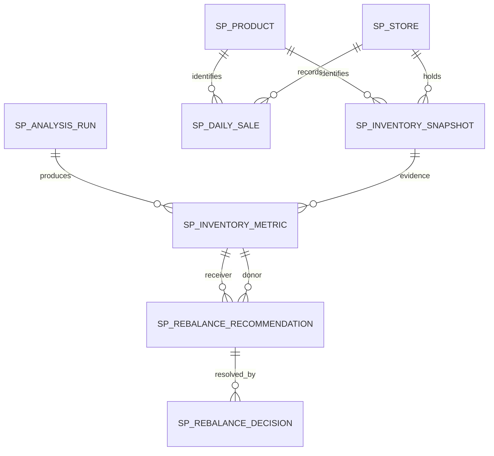
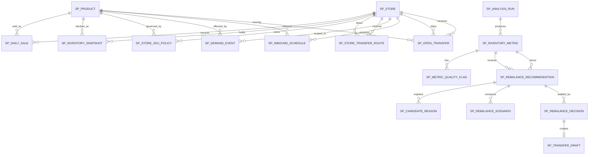

# Data Model and Seed Pipeline

Status: `IMPLEMENTED MVP-2 DATA MODEL` — V6~V15 Oracle/JPA/승인 transaction accepted
Approved: 2026-08-25
Last updated: 2026-08-29

## 1. 설계 목표와 현재 물리 기준선

원본 입력, 재현 가능한 Batch 결과, 후보·시나리오와 사람의 결정을 분리한다.
동일한 `(analysisDate, inputSnapshotVersion, ruleVersion)`은 하나의 논리 분석만
만들고, 새 입력이나 규칙 버전은 과거 결과와 결정 근거를 덮어쓰지 않는다.

현재 Oracle에는 다음 Migration이 실제 존재한다.

| Migration | 실제 책임 | 상태 |
|---|---|---|
| `V1` | 8개 도메인 테이블, 제약과 인덱스 | 구현·검증됨 |
| `V2` | `2026-08-25` MVP-1 Golden SYNTHETIC Seed | 구현·검증됨 |
| `V3` | Spring Batch 6 Oracle metadata | 구현·검증됨 |
| `V4` | 8개 도메인 테이블·54개 컬럼 Comment | 구현·검증됨 |
| `V5` | 한국어 레이블과 `2026-08-26` 확장 SYNTHETIC Seed | 구현·검증됨 |
| `V6` | MVP-2 호환 확장, 신규 입력·결과·결정·Draft 테이블 | 구현·검증됨 |
| `V7` | `MVP-2-GS-V1` GS-01~GS-06 SYNTHETIC 입력 | 구현·검증됨 |
| `V8` | MVP-2 허용값과 데모 경계 Oracle Comment | 구현·검증됨 |
| `V9` | 도메인 Comment 한국어 명사형·코드값 설명 정리 | 구현·검증됨 |
| `V10` | 결정 재시도 식별자·정책 예외 flag, 승인 근거·오류 카탈로그 테이블 신설 | 구현·검증됨 |
| `V11` | 승인 근거 계약 버전·양쪽 예상재고·기승인 Draft 합계, 분석 실행 FK 전환, 오류 카탈로그 세부 코드 | 구현·검증됨 |
| `V12` | `V10`/`V11` 신규·변경 컬럼 Comment를 V9 양식으로 교체(데이터·제약·인덱스 불변) | 구현·검증됨 |
| `V13` | V12에 남은 번역 가능한 영어 Comment 용어 2건 교체(데이터·제약·인덱스 불변) | 구현·검증됨 |
| `V14` | MVP-2 분석 실행/상태 조회 REST 오류 카탈로그 6건 INSERT(스키마 불변) | 구현·검증됨 |
| `V15` | MVP-2 재고 예외 조회 REST 오류 카탈로그 2건 INSERT(스키마 불변) | 구현·검증됨 |

따라서 첨부 초안의 MVP-2 `V5` 번호는 사용할 수 없다. 승인된 구현 순서는
`V6__evolve_stockpilot_mvp2_schema.sql`,
`V7__load_mvp2_synthetic_scenarios.sql`,
`V8__add_mvp2_domain_comments.sql`,
`V9__localize_and_simplify_domain_comments.sql`이며 Phase 1에서 모두 적용됐다.
기존 `V1`~`V8`은 수정하지 않았다.

승인 트랜잭션 기반의 `V10__add_approval_transaction_support.sql`,
`V11__correct_approval_basis_and_error_catalog.sql`,
`V12__align_approval_comments_with_v9_style.sql`,
`V13__translate_remaining_english_comment_terms.sql`도 적용됐으며, 각각 앞선
`V1`~`V9`, `V10`, `V11`, `V12`를 수정하지 않았다. `V14__add_analysis_api_error_catalog.sql`과
`V15__add_inventory_exception_read_error_catalog.sql`은 스키마 변경 없이
`SP_ERROR_CATALOG`에 MVP-2 분석/재고 예외 REST 오류 코드만 추가했다. clean
`V1`→`V15`와 기존 업그레이드 경로, 승인 트랜잭션 JPA/transaction 검증은 모두
통과했다. 최신 실제 test total과 구현·미구현 경계는
[`state/implemented-state.md`](state/implemented-state.md)가 소유한다.

## 2. 보존된 MVP-1 관계와 V6 호환 확장

V1 시점에는 추천당 결정이 최대 1개(`||--o|`)였지만, V6가 `decision_sequence`를
추가해 append-only 1:N(`||--o{`)으로 바꿨다. 위 다이어그램은 V6 이후 현재
관계를 보여준다. V1의 다른 관계는 유지되며 V6 이후 현재 물리 자연키와 상태
shape는 다음과 같다.

- 재고·판매: `(date, store_id, sku_id, input_snapshot_version)` unique
- 분석: `(analysis_date, input_snapshot_version, rule_version)` unique
- 지표: `(analysis_run_id, inventory_snapshot_id)` unique
- 추천: `(receiver_metric_id, donor_metric_id)` unique, 상태·mode별 조건부 수량
- 결정: `(recommendation_id, decision_sequence)` unique. 기존 행은 `MVP-1`,
  신규 shape는 `MVP-2` 계약으로 구분

MVP-2는 이 행을 삭제하거나 과거 성공 이력과 결정을 재작성하지 않는다.

## 3. 구현된 Phase 1 ERD(MVP-2)

`SP_OPEN_TRANSFER`와 두 다중값 자식(`SP_METRIC_QUALITY_FLAG`,
`SP_CANDIDATE_REASON`)은 원 계획서의 수식과 화면 요구를 정규화해 저장하는 데
필요해 명시적으로 추가한 논리 테이블이다. 진행 중 이동을 별도 입력으로 저장하지
않으면 `openTransferInbound/outbound` 계산을 재현할 수 없고, 플래그·탈락 사유를
단일 문자열로 압축하면 검색과 제약이 약해진다.

## 4. 입력 테이블 계약

모든 운영 입력 행은 `input_snapshot_version VARCHAR2(64)`를 가진다. MVP-2
분석에 사용된 입력은 성공 분석 후 수정하지 않고 새 버전을 만든다. 제품·매장의
표시명은 계산 근거가 아니지만 출시일, 소유권 등 계산 필드는 버전 입력과 함께
감사 스냅샷에 기록한다.

### 기존 테이블 확장

| Table | 추가/변경 컬럼 | 적용 제약 |
|---|---|---|
| `SP_PRODUCT` | `launch_date`, `season_code`, `sales_status` | `sales_status IN (PRELAUNCH, ACTIVE, CLEARANCE, ENDED)` |
| `SP_STORE` | `store_type`, `inventory_owner_code`, `transfer_zone` | 필수, 공백 금지 |
| `SP_INVENTORY_SNAPSHOT` | `snapshot_at`, `out_of_stock_flag`, `input_snapshot_version` | 버전 포함 자연키; `Y/N`; 장부·예약 수량 규칙 유지 |
| `SP_DAILY_SALE` | `transaction_count`, `max_transaction_quantity`, `average_selling_price`, `input_snapshot_version` | 모두 0 이상; 최대 거래수량 ≤ 판매수량(판매 0이면 둘 다 0) |

기존 MVP-1 행은 V6에서 `MVP-1-LEGACY`로 backfill했다. 기존 V5 Schema 업그레이드
후 제품·매장 필수 확장 컬럼의 NULL은 0건이고, legacy 재고 67행과 판매 451행의
입력 버전을 Oracle에서 확인했다.

### 신규 원본 테이블

#### `SP_DEMAND_EVENT`

| Column | Meaning |
|---|---|
| `demand_event_id` | surrogate PK |
| `event_code` | 외부 또는 합성 이벤트 ID |
| `event_type` | `PROMOTION`, `PRICE_CHANGE`, `STORE_EVENT`, `OTHER` |
| `store_id`, `sku_id` | MVP-2에서는 둘 다 필수인 명시적 범위 |
| `start_date`, `end_date` | inclusive 기간, start ≤ end |
| `uplift_low`, `uplift_base`, `uplift_high` | nullable; 모두 있으면 `0 < low <= base <= high` |
| `input_snapshot_version`, `source_type` | 입력 버전, 현재 `SYNTHETIC` |

자연키: `(event_code, store_id, sku_id, input_snapshot_version)`.

#### `SP_INBOUND_SCHEDULE`

| Column | Meaning |
|---|---|
| `inbound_schedule_id` | PK |
| `inbound_reference` | 외부/합성 입고 참조 |
| `store_id`, `sku_id`, `quantity` | 도착 매장·SKU·수량 |
| `eta_at`, `inbound_status` | ETA, `PLANNED/CONFIRMED/CANCELLED/RECEIVED` |
| `input_snapshot_version`, `source_type` | 입력 버전과 분류 |

계산에는 `CONFIRMED`만 포함한다. 불완전한 참조 행도 품질 플래그 생성을 위해
적재할 수 있으므로 nullable 허용과 계산 유효성은 구분한다.

#### `SP_OPEN_TRANSFER`

| Column | Meaning |
|---|---|
| `open_transfer_id`, `transfer_reference` | PK, 외부/합성 참조 |
| `donor_store_id`, `receiver_store_id`, `sku_id`, `quantity` | 이동 방향과 수량 |
| `eta_at`, `transfer_status` | `REQUESTED/APPROVED/IN_TRANSIT/CANCELLED/RECEIVED` |
| `input_snapshot_version`, `source_type` | 입력 버전과 분류 |

계산에는 `APPROVED`와 `IN_TRANSIT`만 포함한다. 출발·도착 매장은 달라야 한다.

#### `SP_STORE_TRANSFER_ROUTE`

| Column | Meaning |
|---|---|
| `route_id` | PK |
| `donor_store_id`, `receiver_store_id` | 방향성 있는 경로 |
| `active_flag`, `owner_override_flag` | `Y/N` |
| `lead_time_days` | 0 이상 |
| `minimum_quantity`, `package_multiple`, `maximum_quantity` | 양수, min ≤ max |
| `input_snapshot_version` | 정책 입력 버전 |

자연키: `(donor_store_id, receiver_store_id, input_snapshot_version)`.

#### `SP_STORE_SKU_POLICY`

| Column | Meaning |
|---|---|
| `store_sku_policy_id` | PK |
| `store_id`, `sku_id` | 적용 대상 |
| `display_minimum`, `safety_stock`, `maximum_capacity` | 0 이상, display + safety ≤ capacity |
| `target_coverage_days`, `retained_days` | 0 이상 |
| `input_snapshot_version` | 정책 입력 버전 |

자연키: `(store_id, sku_id, input_snapshot_version)`.

## 5. 분석 결과 테이블

### `SP_ANALYSIS_RUN`

`input_snapshot_version`을 추가하고 unique를
`(analysis_date, input_snapshot_version, rule_version)`으로 안전하게 교체한다.
기존 constraint 이름을 조회·명시해 drop/add하며 `RUNNING/COMPLETED/FAILED`를
유지한다. Spring Batch JobParameters도 같은 세 값을 사용한다.

### `SP_INVENTORY_METRIC`

기존 가용재고·평균판매·커버리지·분류 컬럼은 MVP-1 회귀를 위해 유지한다.
MVP-2에는 다음 책임을 추가한다.

- 관측 근거: `observable_day_count`, `active_week_count`, `sales_day_ratio`,
  `max_daily_sales`, `median_daily_sales`, `mad_daily_sales`,
  `max_transaction_quantity`
- 신호: `primary_demand_signal_type`, `demand_confidence`
- 수요율: `low_demand_rate`, `base_demand_rate`, `high_demand_rate`
- 재고 결과: `projected_available`, `expected_shortage_quantity`,
  `inventory_exception_type`, `severity`
- 추적: `calculation_version` 또는 분석 run FK를 통한 rule/input version

허용값은 `business-rules.md`와 동일한 Check Constraint로 제한한다. 품질 플래그는
다중값이므로 `SP_METRIC_QUALITY_FLAG(inventory_metric_id, flag_code)`의 복합 unique로
저장한다.

## 6. 후보와 시나리오

### 확정 호환안: `SP_REBALANCE_RECOMMENDATION` 확장

기존 테이블과 API identity를 보존하면서 의미를 “donor–receiver 후보 평가와
BASE 대표값”으로 넓히는 안이 승인됐다.

추가 후보 컬럼:

- `route_id`, `candidate_status` (`ELIGIBLE/REJECTED`), `candidate_version`
- `recommendation_mode` (`RECOMMENDED/COMPARISON_ONLY/NONE`)
- `projected_receiver_at_arrival`, `projected_donor_at_dispatch`
- `receiver_capacity_remaining`, `evaluated_at`

현재 양수-only 수량 Check는 상태·mode별 조건부 Check로 교체한다.
`ELIGIBLE/RECOMMENDED`는 부족·공급·BASE 대표수량을 양수로 요구한다.
`ELIGIBLE/COMPARISON_ONLY`는 부족·공급량은 양수지만 `recommended_quantity`는
`NULL`이어야 하며, `VARIABLE`에 사용한다. `REJECTED/NONE`은 수량이 nullable일
수 있다. 탈락 사유는
`SP_CANDIDATE_REASON(recommendation_id, reason_code, reason_order)`에 모두 저장하며
`(recommendation_id, reason_code)`를 unique로 둔다.

신규 Candidate 테이블로 완전히 분리하지 않는다. 기존 FK와 API 호환성을 유지하고
복수 결과는 `SP_REBALANCE_SCENARIO` 자식으로 추가한다.

### `SP_REBALANCE_SCENARIO`

| Column group | Fields |
|---|---|
| Identity | `scenario_id`, `recommendation_id`, `scenario_type` |
| Calculation | `demand_rate`, `scenario_quantity`, `package_multiple` |
| Receiver | before/after available, before/after coverage, risk code |
| Donor | before/after available, before/after coverage, risk code |
| Timing | lead days, expected arrival, inbound included flag |
| Audit | `candidate_version`, warnings, `created_at` |

`scenario_type IN (NO_ACTION, CONSERVATIVE, BASE, AGGRESSIVE)`이며
`(recommendation_id, scenario_type)` unique다. `MANUAL`은 side-effect 없는 API
계산 결과이므로 기본적으로 저장하지 않는다. 승인 시 선택한 수량과 당시 계산
근거는 결정 행에 snapshot으로 남긴다.

## 7. 결정과 이동지시 초안

### `SP_REBALANCE_DECISION`

기존 추천당 1개 unique를 제거하고 append-only 이력으로 전환한다.

| Column | Rule |
|---|---|
| `decision_sequence` | recommendation 안에서 1부터 증가, 복합 unique |
| `decision_status` | `PENDING/HELD/APPROVED/REJECTED/EXPIRED` |
| `selected_quantity` | `APPROVED`만 양수, 나머지는 `NULL` |
| `reason_code`, `reason` | 변경·보류·거절·예외 승인 시 필수 |
| `recommendation_version` | stale 검증용 |
| `actor_label`, `decided_at` | 감사 필수값 |

최신 상태는 가장 큰 `decision_sequence`로 결정한다. 상태 전이 규칙은 Java가
담당하되 DB Check가 수량·사유 shape을 방어한다.

### `SP_TRANSFER_DRAFT`

| Column | Meaning |
|---|---|
| `transfer_draft_id`, `decision_id` | PK, 승인 결정과 1:1 unique |
| `donor_store_id`, `receiver_store_id`, `sku_id`, `quantity` | ERP 초안 payload의 핵심 |
| `draft_status` | `CREATED/READY/SENT/ACCEPTED/REJECTED/EXPIRED` |
| `external_reference`, `payload_version` | nullable 외부 경계와 계약 버전 |
| `created_at`, `updated_at` | 감사 시각 |

MVP-2 구현 범위는 `CREATED` 또는 `READY`까지다. 실제 ERP 호출과 재고 차감은
하지 않는다. 한 트랜잭션에서 승인 결정과 초안을 생성하며 donor 재고 스냅샷 행을
잠그고 아직 취소되지 않은 승인 draft를 합산해 동시 초과 배분을 막는다.

### 승인 감사 근거와 재시도 식별자(V10/V11/V12/V13 구현됨)

`SP_REBALANCE_DECISION`에는 다음 컬럼을 추가한다.

| Column | Rule |
|---|---|
| `decision_request_id` | `Idempotency-Key`; 기존 행은 `LEGACY-{decision_id}`로 backfill 후 NOT NULL/unique |
| `policy_exception_flag` | `Y/N`; `APPROVED`에서만 `Y` 허용 |

승인 당시 재계산 결과는 결정 행의 많은 nullable 컬럼으로 흩뜨리지 않고
`SP_APPROVAL_BASIS`에 승인 결정과 1:1로 보존한다.

| Column group | Fields |
|---|---|
| Identity | `approval_basis_id`(identity PK), `decision_id`(unique FK, 결정과 1:1), `basis_contract_version` |
| Version | `analysis_run_id`, `input_snapshot_version`, `rule_version`, `candidate_version` |
| Eligibility | `candidate_eligible_flag`, `recommended_base_quantity` |
| Current projection | `receiver_projected_before_demand`, `donor_projected_at_dispatch`, `already_approved_draft_quantity` |
| Hard limits | `donor_transferable_quantity`, `receiver_capacity_remaining`, `route_minimum_quantity`, `package_multiple`, `route_maximum_quantity` |
| Audit | `created_at` |

이 테이블은 `APPROVED`에만 생성되고 모든 수량은 비음수, 경로 최소·배수는 양수,
경로 최대는 최소 이상이어야 한다. `candidate_eligible_flag='Y'`만 저장한다. 승인
결정, 감사 근거와 `SP_TRANSFER_DRAFT` 세 행은 같은 트랜잭션에서 모두 commit하거나
모두 rollback한다.

활성 draft 합계는 `CREATED/READY/SENT/ACCEPTED`만 포함하고
`REJECTED/EXPIRED`는 제외한다. 현재 범위에서는 `CREATED/READY`까지만 생성한다.
향후 draft가 `SP_OPEN_TRANSFER`로 수용될 때는 이중 차감을 막도록 draft를 종료
상태로 전환하는 별도 연동 계약이 필요하다.

### DB 오류 카탈로그(V10/V11/V12 구현됨)

`SP_ERROR_CATALOG`은 REST 오류의 표시·전송 메타데이터를 관리한다.

| Column | Rule |
|---|---|
| `error_code` | PK, 클라이언트가 분기하는 안정 코드 |
| `http_status` | `400..599` |
| `title_ko`, `default_detail_ko` | 공백이 아닌 한국어 기본 문구 |
| `retryable_flag`, `active_flag` | `Y/N` |
| `created_at`, `updated_at` | 감사 시각 |

여러 DB 제약을 하나의 오류로 매핑할 수 있도록
`SP_ERROR_CONSTRAINT_MAP(constraint_name PK, error_code FK)`을 별도로 둔다. 제약명은
클라이언트에 노출하지 않는다. 현재 카탈로그는 정확히 13개 행이다.

- 승인 전용 코드 10개: `INVALID_REQUEST`, `INVALID_DECISION_REQUEST`,
  `RECOMMENDATION_NOT_FOUND`, `STALE_RECOMMENDATION`,
  `INVALID_DECISION_TRANSITION`, `IDEMPOTENCY_KEY_REUSED`, `DECISION_CONFLICT`,
  `APPROVAL_LOCK_TIMEOUT`, `PERSISTENCE_UNAVAILABLE`, `INTERNAL_SERVER_ERROR`
- 이 계약 밖 요청을 위한 일반 fallback 3개: `VALIDATION_ERROR`, `NOT_FOUND`,
  `DECISION_ALREADY_TERMINAL`(최신 결정 상태를 실제로 증명할 수 있는 Java 쪽
  business-rule 검사 전용이며, 어떤 DB 제약도 이 코드로 매핑되지 않는다 —
  `UQ_SP_DEC_REC_SEQ` 위반만으로는 terminal 상태를 증명하지 못해
  `DECISION_CONFLICT`로 매핑된다)

오류 문구와 매핑 변경은 Java 서비스 수정이 아니라 후속 Flyway migration으로
재현 가능하게 관리한다. 반대로 수량 계산이나 상태 전이에 쓰이는 도메인 enum을
DB 문구 테이블로 옮기지는 않는다.

## 8. 인덱스와 무결성 원칙

- 모든 날짜는 의미에 맞춰 `DATE` 또는 `TIMESTAMP WITH TIME ZONE`을 명시하고
  시간대 변환은 API 경계에서 고정한다.
- 수량은 음수를 허용하지 않고 상태별 nullable/positive 조건을 Check로 방어한다.
- 조회 인덱스는 28일 `(sku_id, store_id, date, input_snapshot_version)`, 분석 목록
  `(analysis_run_id, severity, exception_type, confidence)`, 후보
  `(receiver_metric_id, candidate_status)`를 우선한다.
- 계산·상태 전이에 쓰이는 코드 허용값은 Oracle Comment와 이 문서, Java enum에서
  동일해야 한다. REST 오류의 전송 메타데이터는 DB 오류 카탈로그가 소유한다.
- 승인 동시성은 “사전 조회 후 insert”만으로 처리하지 않고 공유 donor 근거행에
  대한 DB 잠금과 트랜잭션 내 재계산으로 검증한다.
- 모든 결정은 먼저 추천 행, `APPROVED`이면 그다음 donor 재고 근거행 순으로
  잠근다. 한 요청이 하나의 donor만 잠그며 외부 호출·AI 호출은 트랜잭션 안에서
  수행하지 않는다.
- `SP_TRANSFER_DRAFT(donor_store_id, sku_id, draft_status)` 인덱스로 활성 승인량
  합계를 지원한다.
- 기존 결정과 분석 결과를 cascade delete하지 않는다. 테스트 fixture는 고유
  rule/input version으로 격리하고 자신이 만든 데이터만 정리한다.

### Phase 3 Batch 물리 mapping

- MVP-2 Job은 별도 이름을 사용하고 세 identifying parameter
  `(analysisDate, inputSnapshotVersion, ruleVersion)`를 모두 Spring Batch metadata와
  `SP_ANALYSIS_RUN` natural key에 동일하게 사용한다. 기존 MVP-1 Job과 endpoint는 유지한다.
- 입력 adapter는 정확히 일곱 bulk read 그룹(현재 snapshot+catalog+policy, 28일
  inventory/sales, event, inbound, open transfer, route, 활성 승인 draft 합계)을 한 번씩
  실행하고 store–SKU/lane key로 메모리 grouping한다. 계산 loop 안에서는 SQL을 실행하지
  않는다. 일별 통계와 상태·수량 규칙을 SQL로 복제하지 않고 순수 Java에 맡긴다.
- 요청 버전의 분석일 snapshot이 없거나, anchor store–SKU마다 28개 연속 inventory와
  28개 sales 행이 정확히 없거나, 다른 입력 버전이 섞이면 input-contract failure다.
  결과는 저장하지 않고 run만 `FAILED`로 남긴다. 정책 행 부재만 승인된 기본값을 쓴다.
- `analysisReferenceAt`은 `analysisDate + 1일 00:00 Asia/Seoul`이다. Scenario의
  `expectedArrivalDate`는 `00:00 Asia/Seoul`을 결합해 `expected_arrival_at`에 저장한다.

MVP-2 metric의 legacy 호환 컬럼은 다음처럼 한 번만 변환하며 후속 계산 입력으로
재사용하지 않는다.

| Legacy column | MVP-2 mapping |
|---|---|
| `available_quantity` | 분석일 snapshot의 `onHand - reserved` |
| `average_daily_sales` | 관측 가능일 판매 합계 / 관측 가능일 수, 없으면 0; scale 4 `HALF_UP` |
| `coverage_days` | `currentAvailable / baseline baseDemandRate`; rate가 null/0이면 null, scale 2 `HALF_UP` |
| `classification` | 새 exception과 동일하되 `REVIEW_REQUIRED`만 legacy 허용값 `NON_ACTIONABLE`로 투영 |
| `priority` | 새 severity의 `CRITICAL/HIGH`; `REVIEW/null`은 null |

새 metric 컬럼과 quality child에는 순수 계산의 raw 결과를 각 Oracle scale에 맞춰 저장한다.
`projected_available`은 가장 빠른 활성 도착 기준 receiver projection,
`expected_shortage_quantity`는 baseline BASE 목표수량과 그 projection의 양수 차이다.
`calculation_version`은 Job의 `ruleVersion`이다.

Candidate는 자동 수량 계산 가능한 receiver의 “확정 입고를 제외하면 BASE 부족” lane을
같은 SKU의 다른 anchor store마다 평가한다. route별 projection과 effective event BASE를
사용한다. `ApprovalBasisRecalculation.eligible()`가 참인 안정/이벤트 신호는
`ELIGIBLE/RECOMMENDED`, `VARIABLE`은 `ELIGIBLE/COMPARISON_ONLY`, 나머지는
`REJECTED/NONE`이다. 모든 탈락 사유는 enum 순서로 child에 저장하고 rejected candidate에는
scenario를 만들지 않는다. Eligible candidate는 `NO_ACTION/CONSERVATIVE/BASE/AGGRESSIVE`
네 child를 저장하며 BASE child 수량이 recommendation 대표수량이다.

Scenario coverage는 scale 6 `HALF_UP`, 수요율은 scale 12를 사용한다.
`inbound_included_flag='Y'`는 receiver 또는 donor의 confirmed inbound 수량이 실제 projection에
포함됐을 때만 사용한다. `APPROVED/IN_TRANSIT` open transfer와 활성 draft는 각 before/after
수량에는 반영하지만 이 flag의 의미를 넓히지 않는다.

`RUNNING` 생성/재시작과 예외 후 `FAILED` 기록은 별도 transaction, metric~scenario 저장과
`COMPLETED` 전이는 한 output transaction이다. output 중 어느 insert/flush가 실패해도 모든
결과 child/parent가 rollback된다. 같은 triple의 `FAILED` 재시도는 같은 run 행을
`RUNNING`으로 되돌려 다시 계산하고, `COMPLETED` 재요청은 결과를 추가하지 않는다.

## 9. 구현된 Seed와 Migration

### `V6__evolve_stockpilot_mvp2_schema.sql`

1. 신규 테이블·sequence/identity·FK·Check·index 생성
2. 기존 열 추가와 legacy backfill
3. 기존 unique/check 이름을 명시적으로 교체
4. backfill 검증 후에만 `NOT NULL` 적용
5. `V1`~`V5` 데이터와 MVP-1 API 회귀 확인

### `V7__load_mvp2_synthetic_scenarios.sql`

- `GS-01`~`GS-06`의 입력을 서로 다른 store/SKU 또는 명시적 scenario code로 격리
- 28일 판매와 관측 28일+분석일 재고, 거래 특성, 이벤트, 입고, 진행 중 이동,
  경로와 정책 모두 적재
- 모든 원본 행 `source_type=SYNTHETIC`, 모든 정책값 `ASSUMPTION`
- 기존 `2026-08-25`와 `2026-08-26` 행을 삭제·수정하지 않음

### `V8__add_mvp2_domain_comments.sql`

- 신규/변경 테이블과 컬럼의 최초 MVP-2 도메인 Comment
- `V9`이 표현만 교체하며 V8 파일과 checksum은 보존
- Spring Batch metadata는 도메인 Comment/ERD에서 제외

### `V9__localize_and_simplify_domain_comments.sql`

- V8과 동일한 9개 테이블·149개 컬럼 Comment를 한국어로 교체
- 일반 컬럼은 `출시일`, `재고 소유자 코드` 같은 간결한 명사형 사용
- 코드·상태·플래그 컬럼만 `VALUE: 한국어 의미` 형식으로 허용값 설명
- 데이터 행, 제약, 인덱스와 테이블 구조는 변경하지 않음

### `V10__add_approval_transaction_support.sql`

- 기존 `V1`~`V9`를 수정하지 않고 결정 재시도 식별자와 정책 예외 flag 추가
- `SP_APPROVAL_BASIS`, `SP_ERROR_CATALOG`, `SP_ERROR_CONSTRAINT_MAP` 생성
- 기존 결정의 `decision_request_id` 무손실 backfill(`LEGACY-{decision_id}`)과
  신규 unique/check/index 추가
- 오류 카탈로그 초기값 8개와 알려진 결정·Draft 제약 매핑 적재

### `V11__correct_approval_basis_and_error_catalog.sql`

- 기존 `V10`을 수정하지 않고 Codex 재리뷰가 지적한 다섯 결함을 보정
- `SP_APPROVAL_BASIS`에 `basis_contract_version`·양쪽 예상재고·기승인 Draft
  합계 추가, `analysis_run_id`를 `SP_ANALYSIS_RUN` FK `NUMBER(19,0)`로 전환
  (테이블이 항상 0행임을 PL/SQL guard로 확인 후 진행), `candidate_eligible_flag`를
  `Y`만 허용하도록 제한
- `SP_ERROR_CATALOG`에 `title_ko`/`default_detail_ko`/`active_flag`/`updated_at`과
  승인 세부 코드 5개 추가, `UQ_SP_DEC_REC_SEQ` 매핑을 `DECISION_CONFLICT`로 정정
- `policy_exception_flag='Y'`를 `MVP-2 APPROVED`로 제한하는 Check 추가
- `SP_APPROVAL_BASIS.approval_basis_id`를 포함한 V10/V11 신규 컬럼 전체에
  한국어 Comment 추가(양식은 V12/V13에서 최종 정리)

### `V12__align_approval_comments_with_v9_style.sql`

- 데이터·제약·인덱스는 바꾸지 않고 `V10`/`V11`의 신규·변경 컬럼 Comment만
  V9 양식(일반 컬럼은 간결한 명사형, 코드·상태·플래그는 `값: 의미` 나열)으로
  교체. `donor`/`receiver`는 기존 `SP_STORE_TRANSFER_ROUTE`와 동일하게
  `출고 매장`/`입고 매장`으로, Java 심볼 참조는 제거

### `V13__translate_remaining_english_comment_terms.sql`

- 데이터·제약·인덱스는 바꾸지 않고 V12에 남아 있던 번역 가능한 영어 용어 2건만
  교체. `추천 BASE 수량`→`추천 기준수량`(`SP_REBALANCE_SCENARIO.scenario_type`의
  기존 `BASE: 기준` 선례와 통일), `기승인 활성 Draft 합계 수량`→`기승인 활성
  이동 초안 합계수량`(`SP_TRANSFER_DRAFT` 테이블 Comment `재고 이동 초안`
  선례와 통일)

### `V14__add_analysis_api_error_catalog.sql`

- 스키마 변경 없이 `SP_ERROR_CATALOG`에 MVP-2 분석 실행/상태 조회 REST용 오류
  코드 6건만 INSERT: `ANALYSIS_ALREADY_RUNNING`, `ANALYSIS_LAUNCH_CONFLICT`,
  `ANALYSIS_INPUT_INVALID`, `ANALYSIS_RESTART_UNAVAILABLE`, `ANALYSIS_NOT_FOUND`,
  `ANALYSIS_EXECUTION_FAILED`
- `V11`이 이미 추가한 `title_ko`/`default_detail_ko`/`active_flag`/`updated_at`
  기본값에만 의존하며 기존 행·제약·인덱스는 변경하지 않음

### `V15__add_inventory_exception_read_error_catalog.sql`

- 스키마 변경 없이 `SP_ERROR_CATALOG`에 MVP-2 재고 예외 조회 REST용 오류 코드
  2건만 INSERT: `ANALYSIS_RESULTS_NOT_READY`, `INVENTORY_EXCEPTION_NOT_FOUND`
- `V14`와 동일하게 기존 행·제약·인덱스는 변경하지 않음

`scripts/validate-seed.ps1`은 MVP-1을 먼저 보존 검증한 뒤 CSV header, 자연키,
참조, 기간, 수량, uplift 순서, 경로 min/multiple/max와 여섯 기대 시나리오를
검증하도록 확장됐다.

## 10. 고정된 CSV/입력 파일

| File | Target |
|---|---|
| `products.csv` | `SP_PRODUCT` |
| `stores.csv` | `SP_STORE` |
| `inventory-daily.csv` | `SP_INVENTORY_SNAPSHOT` |
| `sales-daily.csv` | `SP_DAILY_SALE` |
| `demand-events.csv` | `SP_DEMAND_EVENT` |
| `inbound-schedules.csv` | `SP_INBOUND_SCHEDULE` |
| `open-transfers.csv` | `SP_OPEN_TRANSFER` |
| `transfer-routes.csv` | `SP_STORE_TRANSFER_ROUTE` |
| `store-sku-policies.csv` | `SP_STORE_SKU_POLICY` |

파일은 `data/seed/mvp2` 아래에 있고 입력 버전은 `MVP-2-GS-V1`이다. nullable과
허용값은 V6 Check, V9 Comment와 검증 스크립트에서 함께 확인한다.

## 11. 확정된 물리 설계 경계

1. 후보는 동일 소유권 또는 경로가 명시적으로 허용된 국내 매장 사이에서만
   이동 가능 상태가 된다. 위반 입력은 탈락 사유 재현을 위해 저장할 수 있다.
2. 물류센터 노드나 실제 배송 단계 없이 방향성 경로의 `lead_time_days`만 둔다.
3. 이벤트 uplift는 `SP_DEMAND_EVENT`의 low/base/high 입력 컬럼으로 받으며
   시스템이 추정하지 않는다.
4. `VARIABLE` 시나리오는 저장·응답할 수 있지만 recommendation 대표수량은
   `NULL`이며 `recommendation_mode='COMPARISON_ONLY'`로 구분한다.
5. 승인 결정은 실제 재고를 갱신하지 않고 `SP_TRANSFER_DRAFT`만 생성한다.
6. `SP_REBALANCE_RECOMMENDATION`은 유지하고
   `SP_REBALANCE_SCENARIO(recommendation_id, scenario_type)`를 자식으로 추가한다.

모든 Seed 정책값과 화면·API 설명은 `ASSUMPTION`으로 표시하며 실제 F&F 정책이나
검증된 산업 표준으로 표현하지 않는다.
