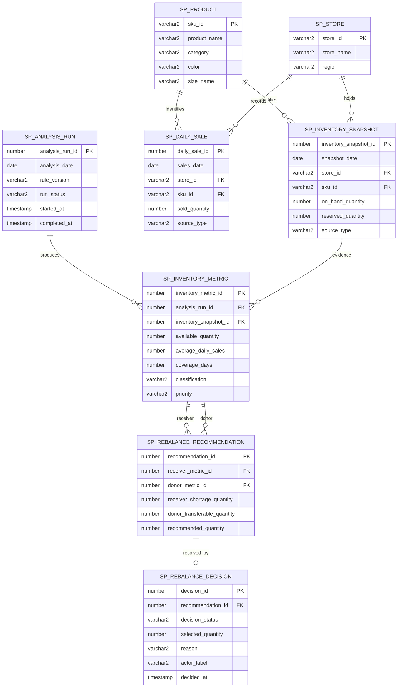
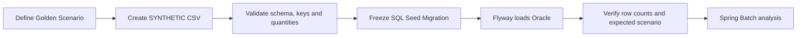

# Data Model and Seed Pipeline

Status: Approved MVP schema baseline
Last updated: 2026-08-25

## 1. Design Goal

The schema separates source facts, reproducible Batch results and human decisions. A changed rule version can create a new analysis without rewriting the inventory and sales evidence that supported an earlier decision.

## 2. ERD

Spring Batch metadata tables are also created by Flyway but are framework infrastructure and are intentionally omitted from the domain ERD.

## 3. Table Responsibilities

| Table | Responsibility |
|---|---|
| `SP_PRODUCT`, `SP_STORE` | Stable demo reference data |
| `SP_INVENTORY_SNAPSHOT`, `SP_DAILY_SALE` | Immutable source evidence for an analysis date |
| `SP_ANALYSIS_RUN` | Idempotency boundary identified by analysis date and rule version |
| `SP_INVENTORY_METRIC` | Java-calculated availability, sales rate, coverage and classification |
| `SP_REBALANCE_RECOMMENDATION` | Deterministic receiver/donor transfer calculation |
| `SP_REBALANCE_DECISION` | One terminal human approval or rejection record |

Simulation is not persisted because it is a temporary what-if calculation. Absence of a decision means the recommendation is `PENDING`.

## 4. Integrity Rules

- Inventory and sales natural keys are unique by date, store and SKU.
- Quantities are non-negative; reserved quantity cannot exceed on-hand quantity.
- Analysis date and rule version are unique, preventing duplicate logical Batch runs.
- Metrics are unique per analysis run and inventory snapshot.
- Receiver and donor metrics cannot be the same row.
- A recommendation has at most one terminal decision in the MVP.
- `source_type` is restricted to `SYNTHETIC` for the current dataset.

## 5. Data Collection and Loading Procedure

The MVP does not collect operational data from a company or scrape public websites.

### Procedure

1. Define the business situation and expected results in `business-rules.md`.
2. Create only the required synthetic columns in `data/seed`.
3. Run `./scripts/local.ps1 seed-check` to validate headers, unique keys, references, non-negative quantities and Golden Scenario totals.
4. Represent the approved snapshot in a new immutable Flyway migration.
5. Start Oracle and Backend; Flyway applies schema and Seed migrations once.
6. Verify reference, inventory and sales row counts before running Batch.
7. If Seed changes after a migration has been applied, add a new migration instead of editing the old one.

## 6. CSV-to-Table Mapping

| Source file | Oracle table | Classification |
|---|---|---|
| `products.csv` | `SP_PRODUCT` | `SYNTHETIC` reference data |
| `stores.csv` | `SP_STORE` | `SYNTHETIC` reference data |
| `inventory.csv` | `SP_INVENTORY_SNAPSHOT` | `SYNTHETIC` operational snapshot |
| `sales.csv` | `SP_DAILY_SALE` | `SYNTHETIC` daily fact |

Thresholds and target days are not collected data. They are `ASSUMPTION` values owned by `business-rules.md`.

## 7. Oracle Comment Convention

- Table and ordinary column comments use short Korean noun phrases such as `상품 기준정보`, `판매일` and `재고 보유일수`.
- Code columns list every allowed value and its Korean meaning.
- Applied schema migrations remain immutable; `V4__add_domain_comments.sql` owns the current comments.
- All eight domain tables and 54 domain columns have comments.
- Spring Batch framework metadata is excluded from domain comment maintenance.
