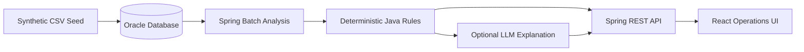

# StockPilot Project Specification

Status: Approved MVP Baseline
Last updated: 2026-08-25

## 1. Product Definition

StockPilot is a fashion inventory exception detection and inter-store rebalancing decision-support system. It identifies the inventory situations that need attention first and presents deterministic transfer alternatives with auditable reasons.

It does not execute physical inventory transfers and is not an ERP replacement.

## 2. Users and Problem

### Primary users

- Merchandise and inventory operations staff
- Store allocation and replenishment staff
- Operators reviewing stockout and overstock exceptions across many SKU-store combinations

### User problem

The user cannot efficiently inspect every SKU-store record. They need a prioritized exception queue, a feasible donor store for the same SKU, and a clear comparison of inventory coverage before and after a proposed transfer.

## 3. MVP Capabilities

1. Load version-controlled synthetic product, store, inventory and sales data into Oracle.
2. Run a Batch analysis for a specified analysis date.
3. Classify SKU-store records as stockout risk, overstock or normal.
4. Rank actionable exceptions and find a donor store for the same SKU.
5. Calculate a recommended transfer quantity using explicit Java rules.
6. Simulate a user-adjusted quantity without changing persisted inventory.
7. Persist approval or rejection, reason, actor label and timestamp.
8. Optionally explain the Java result through an LLM without delegating calculation or state changes.
9. Verify domain calculations with unit tests and the primary path with Oracle integration testing.

## 4. Golden Scenario

Analysis date: `2026-08-25`

- `STORE-GANGNAM` has five available units and sold 28 units during the previous seven days.
- `STORE-HONGDAE` has 40 available units and sold four units during the same period.
- `STORE-SEONGSU` provides a normal comparison record.
- The analysis must identify Gangnam as stockout risk and Hongdae as overstock for `SKU-CAP-BLACK-FREE`.
- A positive Hongdae-to-Gangnam transfer recommendation must be produced.
- A user can change the quantity, compare before/after coverage, then approve or reject it with a reason.

The source records are in `data/seed`. Expected numeric results follow `business-rules.md`.

## 5. Technical Architecture

### Backend

- Java 21 and Spring Boot 4.1
- Spring Web MVC for REST endpoints
- Spring Data JPA for transactional persistence
- Spring Batch for repeatable analysis execution
- Flyway for versioned Oracle schema and Seed migration
- Bean Validation for API boundary validation
- JUnit 5 for domain and integration tests

### Frontend

- React 19, TypeScript 5.9 and Vite 8
- Two primary views: exception list and exception detail/simulation
- No client-side secret or business-rule calculation

### Persistence

- Oracle is the primary database and the integration-verification target.
- H2 is not used as a substitute for Oracle behavior.
- Oracle Database Free 23ai runs as the only Dockerized infrastructure service through the community-maintained `gvenzl/oracle-free:23.26.2-slim-faststart` image.
- Backend and Frontend run directly on the host for fast local debugging.
- Flyway owns the application schema, synthetic Seed and Spring Batch metadata tables.
- Oracle connection details and optional LLM settings are loaded from one ignored root `.env` file.
- Any future server dependency must be added as a pinned Docker Compose service; no additional server is required by the approved MVP.

## 6. Planned API Surface

The implementation may refine names without expanding behavior.

- `POST /api/analyses`: start analysis for an analysis date
- `GET /api/inventory-exceptions`: list analyzed exceptions
- `GET /api/inventory-exceptions/{id}`: retrieve calculation evidence and recommendation
- `POST /api/rebalancing-simulations`: compare a proposed quantity without persistence
- `POST /api/rebalancing-decisions`: approve or reject a recommendation with reason
- `POST /api/inventory-exceptions/{id}/explanation`: optional natural-language explanation

## 7. Data and Audit Requirements

- Every demo operational record is classified as `SYNTHETIC`.
- Every threshold or target value is classified as `ASSUMPTION`.
- Analysis results record the analysis date and rule version.
- Decisions record recommendation identity, selected quantity, status, reason, actor label and timestamp.
- A simulation does not mutate source inventory or an existing decision.

## 8. Acceptance Criteria

The MVP is complete only when all conditions below are demonstrated.

- A clean Oracle schema can be created and populated from version-controlled files.
- Re-running the same Batch analysis does not create duplicate logical results.
- The Golden Scenario produces the classifications and transfer direction defined above.
- Recommendation and simulation results are derived exclusively from the approved Java rules.
- Approval and rejection require a non-blank reason and are persisted transactionally.
- The application starts and core APIs work with AI disabled and without an API Key.
- AI output, when enabled, cannot change quantities or decision status.
- Backend tests and build pass; Frontend TypeScript build passes.
- README commands are executed and corrected if they differ from reality.

## 9. Delivery Workflow

1. Codex plans and specifies.
2. Claude implements the approved slice.
3. Codex reviews tests and behavior first, directly fixing only minor defects.

Commit and push are user-controlled unless explicitly requested.
